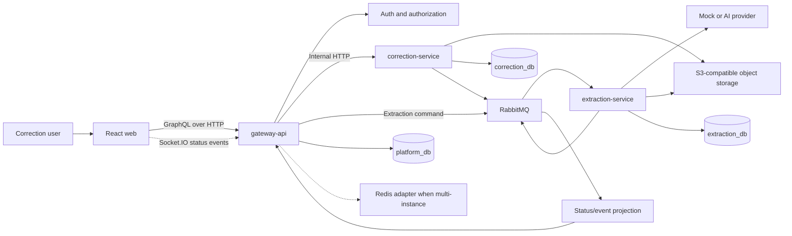
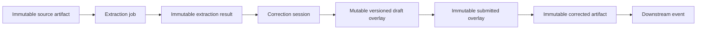
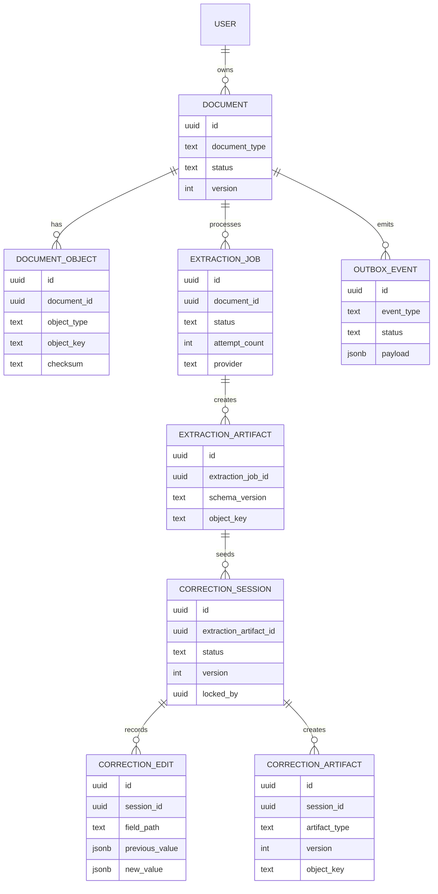
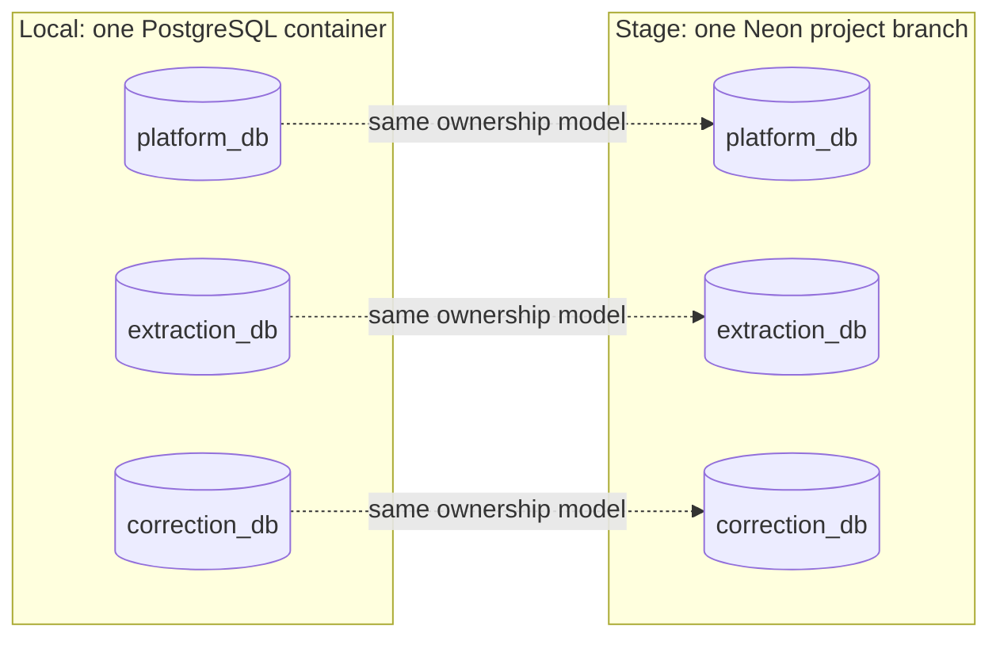
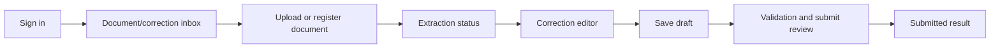
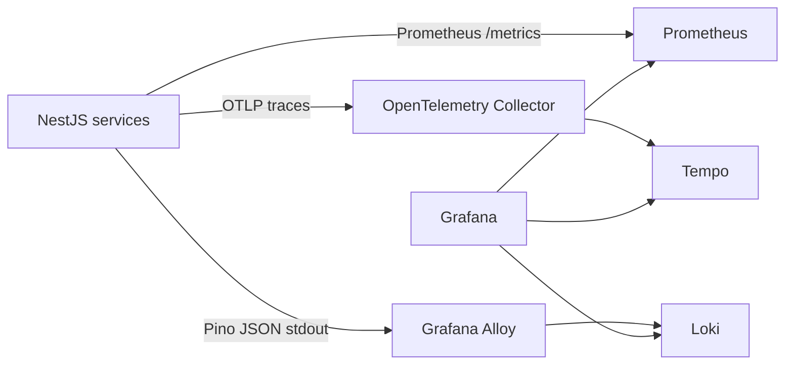
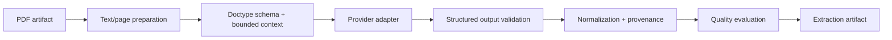
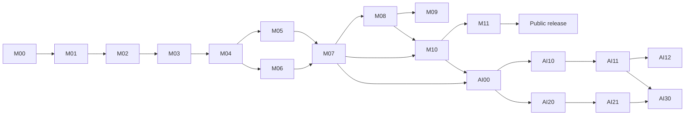

# Elemika General Architecture Plan

Status: Active roadmap  
Last updated: 2026-07-21

## Table Of Contents

- [1. Product Context](#1-product-context)
  - [Purpose](#purpose)
  - [Product Direction](#product-direction)
  - [Existing Foundation](#existing-foundation)
- [2. Architecture Foundation](#2-architecture-foundation)
  - [Architecture Principles](#architecture-principles)
  - [Target Repository Architecture](#target-repository-architecture)
  - [Runtime Architecture](#runtime-architecture)
  - [Document And Artifact Model](#document-and-artifact-model)
  - [Contracts And API](#contracts-and-api)
- [3. Application Tracks](#3-application-tracks)
  - [Backend Track](#backend-track)
  - [Frontend Track](#frontend-track)
- [4. Platform And Operations Tracks](#4-platform-and-operations-tracks)
  - [Local Infrastructure](#local-infrastructure)
  - [Cloud And Delivery](#cloud-and-delivery)
  - [Realtime, Socket.IO, And Redis](#realtime-socketio-and-redis)
  - [Quality, Security, And Observability](#quality-security-and-observability)
- [5. AI Tracks](#5-ai-tracks)
  - [AI Foundation](#ai-foundation)
  - [AI Track A: Extraction](#ai-track-a-extraction)
  - [AI Track B: Correction Assistant](#ai-track-b-correction-assistant)
- [6. Rebranding Track](#6-rebranding-track)
- [7. Roadmap And Governance](#7-roadmap-and-governance)
  - [Priority Model](#priority-model)
  - [Milestone Roadmap](#milestone-roadmap)
  - [Key Risks And Responses](#key-risks-and-responses)
  - [Explicit Non-Goals](#explicit-non-goals)
  - [Immediate Next Plan](#immediate-next-plan)

## 1. Product Context

### Purpose

This document is the high-level architecture and delivery roadmap for evolving
Elemika from an interview-oriented proof of concept into a production-like
full-stack document processing system.

It defines:

- the target frontend, backend, data, infrastructure, cloud, and AI boundaries;
- the decisions already made and the concerns that remain open;
- the order and dependency of major milestones;
- what belongs to P0, P1, and P2;
- the point at which the project must be rebranded for public use.

It intentionally does not contain file-by-file implementation steps. A
milestone receives a focused execution plan before implementation, but that
plan is a working artifact and does not need to remain versioned after the
milestone is complete. Durable behavior belongs in feature documentation;
durable architectural decisions belong in `docs/decisions/`. Planning and
execution conventions are defined in `AGENTS.md` and
`docs/agent-model-conventions.md`.

### Product Direction

Elemika models a human-in-the-loop supplier-document workflow:

1. A user uploads or registers a supplier document, initially a PDF.
2. The platform stores the source document as an immutable artifact.
3. An extraction workflow produces a structured extracted-document artifact.
4. A user reviews the extracted fields, provenance, and validation issues.
5. The user saves draft corrections or submits an approved correction overlay.
6. The platform materializes a corrected document and publishes a downstream
   event.

The local MVP must prove the complete workflow using a deterministic extraction
mock. Real AI extraction and AI-assisted correction are later product tracks,
not prerequisites for validating the core architecture.

### Existing Foundation

The project is not greenfield. The current PoC already contains useful
implementation that should be migrated and improved rather than discarded.

#### Backend baseline

- NestJS gateway application under `apps/gateway-api`.
- Schema-first GraphQL with generated resolver definitions.
- Local JWT signup, signin, `me`, roles, and scopes.
- TypeORM, PostgreSQL migrations, and seed support.
- Correction sessions with source/draft snapshots and optimistic versions.
- Correction flattening, merge, edit audit, submit, and outbox relay logic.
- RabbitMQ publisher foundation.
- HTTP persistence client and file-backed persistence-service mock.
- Docker Compose stack with PostgreSQL, RabbitMQ, API, persistence mock,
  migrations, and seed jobs.

#### Frontend baseline

- React 19 and Vite.
- React Router, Apollo Client, GraphQL code generation, and Material UI.
- Local JWT auth screens and protected routing.
- Corrections inbox with loading, error, empty, filtering, table, and card
  states.
- Storybook, MSW, Vitest/React Testing Library, and Playwright foundations.

#### Main gaps

- The repository layout still represents a single backend API rather than peer
  extraction and correction capabilities.
- The correction editor route and end-to-end frontend correction workflow are
  not implemented.
- The current document model treats a mutable JSON document as the persistence
  center instead of modeling immutable source/extraction/submission artifacts.
- There is no document upload/object-storage lifecycle or extraction job.
- The extraction service and contract-accurate provider mock do not exist.
- CI/CD, stage deployment, operational telemetry, and public branding are not
  mature.

## 2. Architecture Foundation

### Architecture Principles

1. **Local first.** A complete local workflow is the acceptance target before
   cloud deployment.
2. **Preserve working behavior.** Refactor the PoC in controlled milestones;
   do not rebuild it wholesale.
3. **One monorepo, separate runtimes.** Keep atomic contract changes and shared
   tooling while giving gateway, extraction, correction, and web independent
   runtime boundaries.
4. **Schema-first public API.** The gateway owns the public GraphQL SDL so the
   NestJS implementation remains conceptually aligned with a future
   Java/Spring backend.
5. **Artifacts are immutable; workflow state is mutable.** Source, extraction,
   submitted correction, and corrected output are versioned artifacts. Draft
   state is the controlled mutable overlay.
6. **PostgreSQL owns state; object storage owns blobs.** Queue messages and DB
   rows reference large artifacts instead of embedding them.
7. **Async where failure and latency demand it.** Extraction and domain events
   use RabbitMQ; user-facing reads and commands remain synchronous where
   practical.
8. **The gateway is not the domain.** It authenticates, authorizes, exposes
   GraphQL, and orchestrates. Extraction and correction rules belong to their
   domains.
9. **AI is replaceable and measured.** Provider-specific model behavior stays
   behind adapters and is accepted only through schemas, evals, and human
   review.
10. **Telemetry remains portable.** Instrument with OpenTelemetry, Prometheus
    exposition, and structured stdout logs; keep storage and visualization
    backends replaceable.
11. **Establish the product identity early.** Complete the rebrand immediately
    after the repository-boundary refactor so new packages, contracts,
    infrastructure identifiers, and product surfaces use the durable name.

### Target Repository Architecture

The root remains a flat npm-workspaces monorepo. Web and backend applications
are peer workspaces under `apps/`; NestJS does not need a nested monorepo or a
separate `backend/` workspace. Each NestJS application remains independently
runnable, buildable, migratable, and deployable.

```text
elemika/
  apps/
    web/
    gateway-api/
    extraction-service/
    correction-service/

  packages/
    contracts/
    backend-platform/
    testing/

  mocks/
    persistence-service/

  infra/
    local/
    stage/

  docs/
    general-plan.md
    agent-model-conventions.md
    plans/
    decisions/
```

The listed packages are target ownership areas, not a requirement to create
all packages during the first refactor. Service-specific domain code stays
inside its owning application. A shared package is introduced only when code
has a real second consumer or when extracting it enforces an established
contract boundary.

#### Workspace ownership

| Area                      | Owns                                                                      | Must not own                                          |
| ------------------------- | ------------------------------------------------------------------------- | ----------------------------------------------------- |
| `apps/web`                | Browser UI, routing, form state, GraphQL operations                       | Backend domain rules or internal service DTOs         |
| `apps/gateway-api`        | Public GraphQL, auth/authz, request composition, realtime gateway         | PDF processing, correction state transitions, prompts |
| `apps/extraction-service` | Extraction jobs, provider adapters, artifact validation, retries          | User-facing GraphQL or correction decisions           |
| `apps/correction-service` | Sessions, overlays, validation, provenance assembly, submit, audit/outbox | Model-provider details or public auth                 |
| `packages/backend-*`      | Code with genuine backend consumers in more than one application          | Service-owned entities and repositories               |
| `packages/contracts`      | Framework-free event and internal transport contracts                     | NestJS decorators, TypeORM entities, React components |

#### Monorepo decision

The project remains a monorepo through the local MVP and initial stage release.

Benefits:

- atomic changes across GraphQL, events, services, and web;
- one dependency lockfile and consistent local tooling;
- simpler Compose-based local development;
- easier migration while boundaries are still changing.

Concerns and mitigations:

| Concern                          | Mitigation                                                                                       |
| -------------------------------- | ------------------------------------------------------------------------------------------------ |
| Accidental cross-service imports | Enforce package exports and dependency rules in lint/CI                                          |
| Coupled builds and slow CI       | Use path-aware jobs and independent build/test targets                                           |
| Shared-contract churn            | Version event contracts and use compatibility tests                                              |
| Coupled releases                 | Build and deploy each runtime artifact independently                                             |
| Root tooling complexity          | Keep npm workspaces initially; add Turborepo/Nx only after measured need                         |
| Unclear DB ownership             | Give every backend service its own database, credentials, datasource, migrations, and seed scope |

Repository splitting is reconsidered only when team ownership, security,
release cadence, or scaling requirements create a real boundary. It is not a
current milestone.

### Runtime Architecture



#### Communication decisions

| Interaction                | Initial choice                     | Reason                                                  |
| -------------------------- | ---------------------------------- | ------------------------------------------------------- |
| Web to gateway             | GraphQL over HTTP                  | One typed public contract optimized for the UI          |
| Gateway to correction      | Internal HTTP                      | Synchronous correction reads and user commands          |
| Gateway to extraction      | RabbitMQ command                   | Extraction is slow, retryable, and failure-prone        |
| Domain events              | RabbitMQ plus transactional outbox | Reliable asynchronous integration                       |
| Artifact transfer          | S3-compatible object storage       | Avoid large DB rows, HTTP payloads, and queue messages  |
| Live browser updates       | Socket.IO from gateway             | Fits extraction progress and version notifications      |
| Cross-instance live events | Redis Socket.IO adapter            | Required only after multiple gateway instances exist    |
| Future internal RPC        | gRPC only if justified             | Stronger contracts do not yet outweigh local complexity |

GraphQL and WebSocket messages never become the durable source of truth.
PostgreSQL state and immutable artifacts remain authoritative; clients refetch
after receiving a live notification. All backend containers share one Compose
network locally and use private networking such as a shared VPC in cloud; that
network placement does not replace explicit HTTP, RabbitMQ, and database
ownership boundaries.

### Document And Artifact Model

The target lifecycle borrows useful concepts from the real Java backend without
copying its implementation or external-service assumptions.



Important semantics:

- The source document is never overwritten.
- Every extraction result records provider, model, schema, and input versions.
- A correction session references one extraction result as its baseline.
- Draft changes are overlays with optimistic concurrency, not destructive
  rewrites of the extraction artifact.
- Submission creates an immutable overlay and a materialized corrected output.
- Reprocessing creates a new extraction version; it does not silently mutate an
  existing correction baseline.

#### High-level data ownership



Relationships crossing service boundaries in the diagram are conceptual ID
references, not database foreign keys.

#### Database-per-service ownership

| Owner              | Logical database | Primary data                                                          |
| ------------------ | ---------------- | --------------------------------------------------------------------- |
| Gateway/platform   | `platform_db`    | Users, identities, documents, source-object metadata, platform outbox |
| Extraction service | `extraction_db`  | Extraction jobs, attempts, extraction artifacts, extraction outbox    |
| Correction service | `correction_db`  | Sessions, edits, correction artifacts, correction outbox              |

One PostgreSQL server/container is sufficient locally, but it hosts these
three databases with separate service roles. Every service owns its own
TypeORM datasource, `DATABASE_URL`, migrations, migration history, seed scope,
transactions, and outbox.

Boundary rules:

- a service never reads or writes another service's database;
- there are no cross-database joins or foreign keys;
- foreign service IDs are stored only as external references;
- cross-service data is obtained through internal HTTP, RabbitMQ events, or a
  deliberately owned read projection;
- transactions stop at the owning database boundary;
- object storage contains immutable blobs while each database contains only
  the metadata and references owned by that service.

Sharing a PostgreSQL process or managed cluster is infrastructure sharing, not
shared data ownership. The design becomes a distributed monolith only if
services bypass these rules or require coordinated releases and transactions.



### Contracts And API

#### Public GraphQL

The gateway owns schema-first GraphQL SDL. This decision aligns the NestJS MVP
with future Java/Spring implementation and makes the public contract reviewable
without reading TypeScript decorators.

Contract principles:

- handwritten SDL is the public source of truth; generated TypeScript artifacts
  live in explicitly named generated directories and are never edited by hand;
- generated gateway types belong to GraphQL resolvers and transport adapters;
  application/domain services own framework-neutral commands and result views;
- resolvers map generated inputs plus trusted request context, such as the
  authenticated actor, into application commands rather than passing transport
  DTOs through as service APIs;
- generated GraphQL outputs may be returned through structural compatibility,
  but they do not define domain models, persistence entities, internal HTTP
  contracts, or event payloads;
- frontend operations and types are generated independently from the same
  gateway-owned SDL;
- explicit resource responses with `errors`, `warnings`, `messages`, and
  `requestInfo` where partial success is meaningful;
- optimistic-lock tokens or versions on mutable operations;
- server-owned document-type schema and validation metadata;
- typed provenance chains rather than a single source label;
- avoid broad `JSON` fields except at defined artifact boundaries;
- no provider-specific AI response shape in public GraphQL.

Expected public capabilities:

- auth and current-user operations;
- document registration/upload and source-document access;
- extraction status and retry commands;
- correction inbox and correction-document query;
- save-draft and submit-correction mutations;
- document-type schema and validation resources.

#### Internal and event contracts

`packages/contracts` contains framework-free schemas/types for:

- event envelope and versioned event payloads;
- extraction provider result and artifact references;
- internal correction commands/resources if shared across processes;
- document identity, provenance, validation, and status vocabularies.

Events carry IDs, object keys, versions, correlation IDs, and causation IDs.
They do not carry PDFs or full corrected documents.

Initial event families:

```text
extraction.requested.v1
extraction.completed.v1
extraction.failed.v1
correction.draft-saved.v1
correction.submitted.v1
document.corrected.v1
```

## 3. Application Tracks

### Backend Track

#### Gateway API

Responsibilities:

- schema-first GraphQL and resolver composition;
- local JWT first, external OIDC later;
- authorization and user context;
- upload initiation/presigned URL orchestration;
- extraction/correction status composition;
- Socket.IO gateway for notification events;
- request correlation and public rate limits.

The gateway must not own PDF parsing, extraction prompts, correction merge
rules, correction audit transitions, or domain outbox logic.

#### Extraction service

The extraction service is a separate runtime from its first implementation,
even while the provider is deterministic and mocked.

Responsibilities:

- consume extraction commands;
- manage extraction state transitions, retry, and dead-letter behavior;
- load source artifacts and document-type schemas;
- invoke an `ExtractionProvider` interface;
- validate provider output before persistence;
- store raw/structured artifacts and publish completion/failure events.

The mock provider must mimic future AI output accurately: field paths, raw and
normalized values, issues, provenance, confidence placeholders, provider
metadata, and controlled failure fixtures.

#### Correction service

The current correction implementation is migration input for this service.
Pure flatten, merge, path, validation, and provenance assembly logic should move
to a correction-domain library before or during runtime extraction.

Responsibilities:

- load the extraction baseline and server-owned doctype schema;
- assemble correction resources through pure transforms;
- replace generated GraphQL inputs currently consumed by correction services
  with correction-owned application commands and result views; keep mapping in
  gateway resolvers/adapters;
- open/reuse sessions;
- save versioned draft overlays;
- validate required fields and external validation results;
- submit immutable overlays and materialize corrected artifacts;
- record edits and publish through a transactional outbox.

Useful Java-backend ideas to adapt:

- pure document assembler separated from I/O orchestration;
- immutable submitted overlays;
- provenance chains and normalized validation severities;
- source-document URLs through storage adapters;
- optimistic lock checks;
- Scribe/Mercury-like integrations represented as adapters, not embedded domain
  dependencies.

The reference repositories are the active Git checkouts
`network-platform-portal-server` and `network-platform-portal-ui`. Review them
at milestone boundaries when extraction, correction, integration, or
operational design is being changed. Record reusable findings in feature
documentation or ADRs; do not continuously synchronize with them or copy
proprietary implementation and data.

### Frontend Track

#### Target user workflow



Frontend decisions:

- React/Vite remains the browser stack.
- Apollo Client owns GraphQL server state; react-hook-form owns editor state.
- MUI remains the component system.
- React Router owns authenticated workflow routes.
- GraphQL code generation is mandatory at the API boundary.
- Dynamic fields are driven by server metadata, not document-type-specific
  React branches.
- Header sections use compact forms; repeated/nested rows use dense editable
  tables or grids.
- The editor shows provenance, validation issues, original values, and edit
  history without allowing those concerns to block basic editing.
- Version conflicts are explicit UX states; live notifications trigger refetch,
  not silent draft replacement.

Expected routes/views:

- signin/signup and later OIDC callback;
- documents/corrections inbox;
- upload/registration;
- extraction progress/failure/retry;
- correction editor;
- submit confirmation and result summary.

The frontend is a static deliverable. It runs directly with Vite locally and is
built for vendor-neutral object storage plus a CDN or an equivalent static
host. A frontend Docker image/Compose service is not required.

## 4. Platform And Operations Tracks

### Local Infrastructure

Local operation is the first deployment target. The React application runs
directly through Vite; backend applications and dependencies run on one Docker
Compose network.

The backend stack launches through root npm commands backed by dedicated shell
scripts, following the useful operational pattern from `rd_shop`:

```text
npm run local:up
npm run local:migrate
npm run local:seed
npm run local:reset
npm run local:observability
```

The scripts build/start the stack, run service-specific one-off migration and
seed jobs when requested, remove their containers with
`docker compose run --rm`, and expose deterministic health/reset operations.
Application startup must not silently execute migrations.

`local:observability` starts an optional Compose profile. The core local stack
must remain usable without the additional telemetry services.

PostgreSQL initialization creates `platform_db`, `extraction_db`, and
`correction_db` plus one least-privilege application role for each. Compose
defines separate migration and seed jobs per owner; aggregate npm scripts run
those jobs in a deterministic order without granting cross-database access.

Target local services:

```text
gateway-api
extraction-service
correction-service
PostgreSQL (one container with three service databases and roles)
RabbitMQ
MinIO
persistence-service mock (while the black-box adapter remains relevant)
Redis (optional profile until realtime/multi-instance work)
```

The optional observability profile adds Prometheus, Grafana, Loki, Tempo, an
OpenTelemetry Collector, and Grafana Alloy. These services are not dependencies
of normal application startup.

Concerns:

- avoid requiring all services for narrow unit-test or frontend workflows;
- use health/readiness dependencies rather than startup sleeps;
- give each backend application an independent datasource, migration job, and
  seed command;
- keep fixture resets explicit to avoid surprising data loss;
- do not put secrets in checked-in local env files.

### Cloud And Delivery

Cloud work begins only after the complete mocked workflow works locally.

#### Stage architecture

| Capability     | Direction                                                                                     |
| -------------- | --------------------------------------------------------------------------------------------- |
| Web            | Static build to vendor-neutral object storage plus CDN, or an equivalent static host          |
| Backend apps   | Independent container artifacts on a low-cost managed runtime                                 |
| PostgreSQL     | Neon, with a logical database, role, connection string, and migration job per backend service |
| Object storage | S3-compatible managed storage, preferably using the same adapter as MinIO                     |
| RabbitMQ       | Managed broker for extraction commands and reliable domain-event delivery                     |
| Redis          | Managed Redis only when multiple gateway instances or presence require it                     |
| Observability  | OpenTelemetry, Prometheus, Grafana, Loki, and Tempo using open protocols                      |
| Networking     | Private service connectivity within the provider's isolated network                           |
| Secrets        | Platform secret store/environment injection                                                   |

Neon is the selected managed PostgreSQL direction. The initial stage uses one
Neon project and branch containing `platform_db`, `extraction_db`, and
`correction_db`. Preview branches may copy all three databases for CI and
feature validation. Each application connects only with its own role and
database URL, and the combined connection-pool budget must fit the shared
branch compute.

Databases in the same Neon branch share compute and an operational failure
domain. This is acceptable for the MVP because ownership is still isolated.
A future production environment should use a separate Neon project; an
individual service can move to its own project later if independent scaling or
stronger isolation becomes necessary. See the Neon documentation for
[databases](https://neon.com/docs/manage/databases),
[projects](https://neon.com/docs/manage/projects), and
[branching](https://neon.com/docs/get-started-with-neon/workflow-primer).

Compute, broker, and hosting provider selection remains deferred because
free-tier products and prices change. The architecture must remain portable
across self-hosted, managed open-compatible, and lower-cost providers.

The stage observability deployment is selected during M11. It may be a
single-node self-hosted stack with short retention or a managed free-tier
backend compatible with Prometheus and OTLP. Application code must not use a
provider-specific telemetry SDK. A managed backend is acceptable only when the
instrumentation and export contracts remain portable.

#### CI/CD boundaries

PR checks:

- formatting check, lint, and type checking;
- affected unit/integration tests;
- GraphQL and event contract checks;
- frontend build and Storybook build where relevant;
- backend container builds;
- Dockerfile Roast policy checks for changed container definitions;
- dependency, secret, and container scanning.

Stage delivery:

- publish web static artifact independently;
- build/tag each backend image independently;
- run only the owning service's backward-compatible migrations as an explicit
  one-off job before deploying that service;
- deploy services in dependency order;
- run health and end-to-end smoke tests;
- preserve rollback instructions and previous artifacts.

#### M11 production container and deployment hardening

M11 turns the M03 development-image policy into independently deployable stage
artifacts:

- create a multi-stage production Dockerfile for each backend application;
- install/build only the owning workspace and required shared packages rather
  than the complete monorepo dependency graph;
- copy only compiled runtime artifacts and production dependencies into the
  final image;
- run as a non-root user with a read-only filesystem, dropped capabilities, and
  narrowly scoped writable temporary paths where the selected runtime permits;
- keep migration execution in explicit one-off jobs and out of normal
  application startup;
- define separate liveness and readiness semantics, then configure the selected
  stage orchestrator's probes rather than assuming a development Dockerfile
  `HEALTHCHECK` is portable;
- pin complete base-image versions and reviewed digests, with controlled
  automated update proposals;
- generate an SBOM and perform dependency, image vulnerability, secret, and
  provenance/signature checks before publication;
- publish immutable image tags and retain the previous deployable artifact for
  rollback;
- run post-deployment health and full-stack smoke checks against stage.

The frontend remains a static artifact and does not receive a production
container unless the selected hosting platform demonstrates a concrete need.

There is no production environment in the initial roadmap. The public stage is
the production-like learning target.

### Realtime, Socket.IO, And Redis

Socket.IO fits the product flow but is not part of the local P0 correctness
path.

Good live events:

- extraction queued, processing, completed, or failed;
- document version changed;
- correction submitted;
- optional reviewer presence and soft-lock status.

Rules:

- GraphQL remains the command/query API.
- Live events contain status and identifiers, not full document state.
- Clients refetch authoritative data after an event.
- Authentication and authorization apply to connection and room joins.
- Event payloads are schema validated and rate limited.
- In-memory Socket.IO is sufficient for a single local gateway.
- Redis adapter is introduced when testing multi-instance fan-out or deploying
  more than one gateway instance.

Field-level collaborative editing, distributed locks, conflict-free data types,
and durable WebSocket delivery are P2 and not implied by adding Socket.IO.

### Quality, Security, And Observability

These are acceptance concerns in every milestone, followed by a dedicated
hardening milestone.

#### Review process foundation

M03 establishes the review process after the M02 rename and before new domain
and infrastructure work accumulates. Its detailed implementation plan is
written only after M02 lands so repository names, package paths, GitHub
settings, and review instructions are stable.

The milestone covers three review layers:

1. **Local verification.** Add non-mutating root checks for formatting, lint,
   types, tests, builds, and proportionate integration/Compose verification.
   Provide a fast default verification command and a broader full-stack command.
2. **Local AI review.** Define a read-only diff review workflow against the
   merge base. Reviews report findings first, use file/line evidence, rank
   severity, record checks performed, and state residual risk when no issue is
   found. A fresh review task is preferred for risky or cross-cutting changes.
3. **GitHub PR review.** Add a PR template, pull-request CI, path-aware jobs,
   merge-check guidance, and Codex GitHub review through automatic review or an
   explicit `@codex review` request. Deterministic checks remain the merge
   signal; AI review is an independent reasoning signal.

M03 also introduces a committed repository skill under
`.agents/skills/<new-product-name>-code-review/`. It classifies changed paths
and risk surfaces, selects only the relevant installed specialist skills, runs
or requests the appropriate reviews, and produces one normalized review report.
It must not indiscriminately load every installed skill or modify code unless
the user separately requests a fix.

##### M03.1 Toolchain alignment

M03 establishes one explicit local/container/CI toolchain contract:

- select the supported Node 24 patch release, or Node 26 only if it has reached
  LTS and the repository dependency matrix is compatible;
- if M03 lands before Node 26 LTS, complete M03 on Node 24 and use a dedicated
  later M03.x maintenance change rather than delaying the milestone;
- align root `engines`, the selected local version-manager file, README
  prerequisites, Docker base images, and future CI setup;
- pin the development Docker base to a complete Node patch and Alpine variant
  instead of a floating `node:24-alpine` tag;
- decide whether the project follows npm bundled with the selected Node image
  or intentionally pins npm independently;
- when bundled npm is selected, remove `NPM_VERSION` and the global
  `npm install -g` Docker layer;
- when an independent npm major is selected, treat its installation and
  compatibility verification as an explicit package-manager migration;
- establish reviewed automated proposals for future Node image and digest
  updates without accepting them automatically.

##### M03.2 npm supply-chain policy

M03 selects npm 11.18 or npm 12 deliberately and aligns `package.json`,
`.npmrc`, local setup, containers, and CI. The baseline includes:

- keep the committed lockfile and use `npm ci` for reproducible CI installs;
- configure npm's `min-release-age` with an initial seven-day quarantine and
  narrowly documented exceptions for urgent security fixes or owned packages;
- restrict git, remote tarball, file, and directory dependency sources unless
  they are explicitly reviewed;
- use temporary `--ignore-scripts` for metadata-only dependency changes and a
  reviewed install-script allowlist for normal installs rather than globally
  disabling scripts required by tools such as native or platform binaries;
- add dependency-advisory and registry-signature/provenance checks, initially
  advisory where ecosystem coverage prevents a clean blocking baseline;
- require humans to mutate dependencies through reviewed npm uninstall/install
  commands and review the resulting manifest and lockfile diffs;
- prohibit automated force fixes, legacy peer resolution, suppressive
  overrides, and manual dependency or lockfile edits.

The exact policy depends on the selected npm version. npm 11's install-script
allowlist requires a sufficiently recent minor, while npm 12 changes
install-script and dependency-source defaults and therefore requires an
explicit migration review rather than an incidental upgrade.

##### M03.3 Development Docker cleanup and policy

M03 corrects the existing local development images without turning them into
production artifacts:

- remove `bash`, `python3`, `make`, and `g++` from the gateway development image
  while no container command or installed dependency requires them;
- if a future native dependency requires compilation, install build tools in a
  bounded build stage or temporary Alpine virtual package and remove them from
  the resulting runtime layer;
- scope container dependency installation to the owning workspace and required
  root tooling where npm workspace behavior permits it;
- add Compose health checks for `gateway-api` and `persistence-mock`, using
  existing `/health` endpoints and no additional HTTP utility package;
- keep one-shot migration and seed jobs free of inappropriate health checks;
- document a narrow DF012 exception for the shared development/tooling
  Dockerfile because service health is owned by Compose;
- leave multi-stage production images, production probes, SBOMs, and built-image
  scanning to M11.

M03 adopts
[Dockerfile Roast](https://github.com/immanuwell/dockerfile-roast) as a narrow
container-definition gate. It provides Dockerfile-specific static rules and
GitHub annotations; it does not replace container builds, Compose validation,
image vulnerability/SBOM scanning, or runtime smoke checks.

Rollout:

1. Add a committed `droast.toml` and run the `production` preset with technical
   output (`no-roast`) against every repository Dockerfile.
2. Start the PR job in advisory mode while existing findings are classified and
   corrected. Any skipped rule must have a repository-specific rationale.
3. Make findings that violate the configured policy blocking once the initial
   baseline is clean. Trigger the job only for Dockerfiles, `.dockerignore`,
   `droast.toml`, and the owning workflow; keep a manual dispatch path for full
   audits.
4. Pin the GitHub Action reference and its `image-tag` to a reviewed release.
   Automated dependency tooling may propose controlled upgrades.

Agents do not run Dockerfile Roast locally. A human may run the documented
local command, while GitHub Actions executes the deterministic PR gate. M10
adds the complementary built-image, dependency, secret, and runtime security
checks.

For a solo repository, the GitHub process must not require an unavailable human
approval. Required status checks and resolved review conversations are the
enforceable controls when repository visibility and the GitHub plan support
branch rules.

#### Testing

The detailed test taxonomy, MSW ownership, local-versus-stage system strategy,
and milestone responsibilities are maintained in
[Testing Strategy](./testing-strategy.md).

- unit tests for pure domain transforms, validation, and event builders;
- integration tests for repositories, GraphQL, RabbitMQ, and object storage;
- contract tests for GraphQL SDL, events, and provider output;
- Playwright coverage for the upload-to-submit happy path and critical failures;
- AI evals kept separate from deterministic software tests.

#### Security

- local JWT initially; external OIDC as P1;
- roles/scopes at public operations;
- service authentication when processes are remotely deployed;
- GraphQL operation budgets and request rate limits before stage exposure;
- in M10, evaluate modular GraphQL Armor limits for tokens, aliases, depth,
  directives, and cost against Yoga-native/Envelop alternatives;
- for the first-party web client, evaluate persisted-operation allowlisting as
  a stronger stage/production control while retaining unrestricted local
  GraphiQL development;
- keep HTTP/user rate limiting, request-body limits, timeouts, and execution
  cancellation separate from GraphQL document-complexity controls;
- strict upload type/size limits and malware-handling decision before public use;
- short-lived presigned URLs;
- no secrets or sensitive document contents in logs/events;
- dependency, secret, and image scanning in CI;
- explicit AI prompt-injection and PII threat model before AI tools are exposed.

#### Observability

The project uses open protocols and self-hostable components rather than a
cloud-provider-specific telemetry SDK.



Signal ownership:

| Concern         | Component and contract                                                         |
| --------------- | ------------------------------------------------------------------------------ |
| Instrumentation | OpenTelemetry SDK and W3C trace context; no backend-specific application API   |
| Metrics         | Prometheus scrape endpoints and PromQL                                         |
| Logs            | Structured Pino JSON collected from container stdout by Grafana Alloy          |
| Traces          | OTLP through the OpenTelemetry Collector into Tempo                            |
| Visualization   | Grafana with provisioned Prometheus, Loki, and Tempo data sources              |
| Alerting        | Prometheus/Grafana alerting initially; Alertmanager only when routing needs it |

Baseline requirements in every implementation milestone:

- structured Pino logs with service, environment, operation, outcome, and
  duration fields;
- request, correlation, causation, message/job, and trace IDs propagated across
  HTTP, GraphQL, RabbitMQ, and later AI calls;
- health/readiness endpoints per runtime;
- no secrets, document bodies, prompt contents, or PII in telemetry;
- local failure visibility through stdout and Compose logs without requiring
  the observability profile.

M10 adds the production-like observability stack:

- application and infrastructure scrape targets for Prometheus;
- metrics for API latency/error rate, DB latency, queue depth, retry/DLQ counts,
  extraction duration, correction submit latency, and AI evaluation results;
- OpenTelemetry spans for HTTP, GraphQL, TypeORM, RabbitMQ, and artifact access;
- trace IDs in structured logs and Grafana links between metrics, traces, and
  logs;
- provisioned data sources, a service-overview dashboard, and an
  extraction/correction workflow dashboard;
- a small set of actionable alerts;
- explicit cardinality, sampling, storage-retention, and redaction controls.

M10 acceptance requires one document operation to be visible as a Prometheus
latency/error metric, a cross-service Tempo trace, and correlated Loki logs.
The observability profile uses single-node/local storage and short retention.
Mimir, Kubernetes, high availability, and distributed Loki/Tempo modes are not
required. Promtail must not be introduced; Grafana Alloy is its maintained
replacement.

## 5. AI Tracks

### AI Foundation

Real model integration begins only after the platform can process a mocked
extraction result through correction and submission end to end.

Shared AI foundation:

- provider-neutral TypeScript interfaces;
- versioned prompts and structured output schemas;
- immutable input/output artifacts where safe;
- model/provider, latency, token, and cost metadata;
- fixture datasets and an in-repo eval harness;
- retry, timeout, rate-limit, circuit-breaker, and fallback behavior;
- PII handling and prompt-injection defenses;
- human approval before any correction is applied or submitted.

TypeScript/NestJS remains the product harness. Python is optional for
coursework, OCR/ML experiments, or self-hosted inference where its ecosystem is
materially stronger. The runtime architecture must not depend on Python unless
a later milestone proves the need.

### AI Track A: Extraction

Goal: transform a supplier PDF into a schema-valid structured draft with
provenance and measurable quality.

The extraction track is pipeline-oriented rather than artificially agentic.
It is the strongest fit for structured output, prompt engineering, context
management, reliability, and evaluation.



Progression:

1. Freeze one-document-type contract and representative fixtures.
2. Extract machine-readable PDF text and header fields.
3. Add prompt/schema versioning, replay, and eval reporting.
4. Add source snippets, page provenance, and confidence calibration.
5. Add page images/vision for documents where text is insufficient.
6. Add line items and nested tables only after header extraction is reliable.
7. Add provider comparison, cost controls, drift monitoring, and safe fallback.

Fine-tuning, custom training, GPU inference, and broad OCR support are P2 until
evaluation shows that prompt/schema/provider work is insufficient.

### AI Track B: Correction Assistant

Goal: help a reviewer understand validation failures and propose corrections
without giving the model direct authority over durable state.

This track is the stronger fit for agentic architecture, tool design, MCP, and
context/reliability practice.

Initial tools:

- load correction document and field context;
- retrieve bounded source snippets or page references;
- retrieve document-type rules, code lists, and validation results;
- propose typed field edits with explanations;
- validate a proposed edit set;
- summarize changes before human submission.

Rules:

- read tools and proposal tools are separate from mutation commands;
- the model cannot write directly to PostgreSQL or submit a document;
- every proposal is schema validated and shown to the reviewer;
- context is assembled per document/field with explicit size limits;
- tool calls, model version, prompt version, and accepted/rejected suggestions
  are traceable for evaluation;
- MCP may expose the same business tools to supported agent hosts, but the core
  application uses provider-neutral tool contracts and does not depend on a
  personal Claude subscription.

Provider harnesses are similar at the architectural level but not identical.
Tool-call formats, structured-output guarantees, context limits, safety
features, and SDK behavior remain behind provider adapters. Codex/OpenAI,
Claude where available, and suitable open-source models can be evaluated
against the same fixtures and contracts.

#### CCAF alignment

| CCAF domain                            | Elemika practice area                                                                          |
| -------------------------------------- | ---------------------------------------------------------------------------------------------- |
| Agentic Architecture & Orchestration   | Correction-assistant workflow, bounded delegation, human approval                              |
| Tool Design & MCP Integration          | Typed document/rule/validation tools and optional MCP server                                   |
| Claude Code Configuration & Workflows  | Development workflow only; transferable repo instructions, plans, reviews, and eval discipline |
| Prompt Engineering & Structured Output | Extraction/correction schemas, prompt versions, typed proposals                                |
| Context Management & Reliability       | Bounded document context, provenance, retries, evals, fallbacks, observability                 |

The product should not add needless agents merely to match an exam domain.
Extraction remains a deterministic workflow unless an agentic decision loop
demonstrably improves quality.

## 6. Rebranding Track

`Elemika` is too close to `Elemica` for a public repository, hosted demo, or
presentation. Rebranding is an early P0 milestone: it follows the M01
repository-boundary refactor and precedes new product functionality.

### Timing

- Complete M01 first so the rename targets the intended long-lived repository
  and application boundaries.
- Select and apply the new name in M02 before adding the data, extraction,
  correction, cloud, and AI foundations.
- Treat any later public-release check as an audit for missed references and
  sensitive material, not as another product rename.

### Scope

- availability/confusion check for the new name;
- repository and package names;
- UI name, logo, page titles, copy, and screenshots;
- environment-variable prefixes and service/container identifiers;
- object-storage buckets/prefixes and event producer names where appropriate;
- README, diagrams, sample data, and public documentation;
- GitHub repository metadata and deployment URLs;
- explicit independent-learning-project disclaimer;
- scan for private paths, credentials, proprietary source, copied assets, and
  unintended references to the real Elemica system.

Historical architecture decisions may retain factual references to the Java
system as research context, but public artifacts must not imply affiliation or
reuse proprietary code/data.

## 7. Roadmap And Governance

### Priority Model

Priority is relative to the local product MVP first and the AI/public portfolio
stage second.

#### P0: Core and release gates

- repository boundary refactor without behavior regression;
- schema-first gateway and generated frontend contracts;
- PostgreSQL state model and S3-compatible artifact model;
- deterministic extraction service/provider mock;
- correction editor and complete local upload-to-submit flow;
- optimistic locking, immutable submitted artifact, audit, outbox, retry/DLQ;
- focused tests, baseline security, health, and structured logs;
- early rebranding immediately after the repository boundary refactor;
- local verification, local AI review, and GitHub PR quality gates;
- AI contracts/evals before the first real model is accepted.

#### P1: Production-like capability

- Socket.IO extraction/version notifications;
- Redis adapter when multi-instance behavior is exercised;
- external OIDC;
- stage CI/CD and public demo deployment;
- richer provenance and source-document UX;
- first real text-based AI extraction provider;
- correction suggestion tools, MCP exposure, and provider comparison;
- OpenTelemetry instrumentation plus Prometheus, Grafana, Loki, and Tempo
  dashboards and correlation.

#### P2: Deferred complexity

- field-level collaborative editing and distributed locking;
- gRPC internal APIs or repository splitting;
- broad OCR, arbitrary layouts, complex multi-page tables;
- fine-tuning, custom model training, GPU serving, or Kubernetes;
- autonomous correction/submission;
- multi-region/high-availability architecture;
- Mimir or another distributed metrics backend, long-term telemetry retention,
  and distributed/high-availability Loki or Tempo;
- full enterprise account lifecycle and advanced analytics.

### Milestone Roadmap

Every milestone below receives a focused implementation plan before execution.
The plan may be removed or archived after completion once durable decisions and
behavior are captured in ADRs and feature documentation. Status is updated here
only at milestone granularity.

| ID   | Milestone                                      | Track          | Priority | Status      | Depends on         | Outcome                                                                                             |
| ---- | ---------------------------------------------- | -------------- | -------- | ----------- | ------------------ | --------------------------------------------------------------------------------------------------- |
| M00  | Architecture and execution governance          | Governance     | P0       | Completed   | Existing PoC       | Roadmap, agent/model conventions, and decision process established                                  |
| M01  | Monorepo boundary refactor                     | Platform/BE/FE | P0       | In progress | M00                | Flat `apps/*` workspaces, contracts package, independent NestJS targets, unchanged local behavior   |
| M02  | Product rebrand and namespace migration        | Rebrand        | P0       | Planned     | M01                | Durable product identity applied before new code and infrastructure accumulate                      |
| M03  | Review process and quality gates               | Governance/QA  | P0       | Planned     | M02                | Human/AI/PR review, Dockerfile and npm supply-chain policy, deterministic quality gates             |
| M04  | Local data and artifact foundation             | BE/Infra       | P0       | Planned     | M03                | Per-service databases, document lifecycle, MinIO/S3 adapter, migrations, seed, one-command stack    |
| M05  | Extraction service with contract mock          | BE/Infra       | P0       | Planned     | M04                | Async job lifecycle, deterministic provider, artifacts, events, failures                            |
| M06  | Correction domain and service hardening        | BE             | P0       | Planned     | M04, M05 contracts | Overlay model, pure assembler, immutable submit, audit/outbox                                       |
| M07  | End-to-end frontend workflow                   | FE/BE          | P0       | Planned     | M05, M06           | Upload/status/inbox/editor/draft/submit works locally                                               |
| M08  | Async reliability and integration              | BE/Infra       | P0       | Planned     | M05, M06           | Retry, DLQ, idempotency, outbox relay, reprocess flow                                               |
| M09  | Realtime status                                | FE/BE/Infra    | P1       | Planned     | M07, M08           | Socket.IO notifications; Redis only when multi-instance is tested                                   |
| M10  | Quality, security, and observability hardening | Cross-cutting  | P0/P1    | Planned     | M07, M08           | Contract/E2E confidence, GraphQL budgets, threat model, open observability stack, runbooks          |
| M11  | Stage CI/CD and cloud deployment               | Cloud          | P1       | Planned     | M10                | Hardened immutable backend images, static web delivery, stage probes, SBOM/security gates, rollback |
| AI00 | AI contract, fixtures, and eval foundation     | AI shared      | P0 AI    | Planned     | M07, M10           | Provider-neutral schemas and measurable acceptance baseline                                         |
| AI10 | Text-based extraction provider                 | AI extraction  | P0 AI    | Planned     | AI00, M05          | One document type extracted from digital PDFs with structured output                                |
| AI11 | Extraction provenance and reliability          | AI extraction  | P1       | Planned     | AI10               | Prompt/replay metadata, provenance, confidence evaluation, guardrails                               |
| AI12 | Vision and line-item extraction                | AI extraction  | P1/P2    | Planned     | AI11               | Evidence-based expansion to scans/images and repeated rows                                          |
| AI20 | Correction tool layer and MCP                  | AI correction  | P1       | Planned     | AI00, M06, M07     | Typed read/proposal tools and optional MCP exposure                                                 |
| AI21 | Agentic correction workflow                    | AI correction  | P1       | Planned     | AI20               | Human-approved suggestions, validation explanations, trace/eval loop                                |
| AI30 | AI operations and provider evaluation          | AI shared      | P1       | Planned     | AI10, AI21         | Cost, latency, safety, drift, fallback, and model comparison                                        |

#### Dependency view



M02 removes the `Elemika` identity before new domain and infrastructure work
accumulates. M03 then establishes the review process used by every later
milestone. M11 includes a final public-content and sensitive-material audit,
but it does not repeat the product rename.

### Key Risks And Responses

| Risk                                         | Response                                                                                  |
| -------------------------------------------- | ----------------------------------------------------------------------------------------- |
| Refactor destroys useful PoC behavior        | Move paths first, extract domains incrementally, verify each existing flow                |
| Gateway becomes a new monolith               | Keep domain services/libraries authoritative and enforce import ownership                 |
| Generated GraphQL types become domain APIs   | Confine them to resolver/adapter boundaries; map to service-owned commands and views      |
| Service bypasses database ownership          | Separate DB roles and migrations; prohibit cross-database access, joins, and foreign keys |
| Contract drift breaks FE/services            | Schema generation, versioned events, and contract tests in CI                             |
| AI review creates false confidence           | Keep deterministic verification as the merge gate and treat AI findings as advisory       |
| Too many skills dilute review focus          | Route by changed area and risk; select only a small relevant specialist set               |
| Dockerfile lint is mistaken for image safety | Keep builds, image/SBOM scanning, and runtime checks as independent quality gates         |
| Artifact model duplicates too much data      | Store immutable blobs cheaply; DB keeps references and workflow metadata                  |
| RabbitMQ/Compose complexity slows local work | One-command scripts, health checks, narrow service profiles, deterministic fixtures       |
| Observability stack slows normal local work  | Keep it in an optional Compose profile with short retention and single-node components    |
| Telemetry cardinality or volume grows        | Bound labels, sample traces, redact payloads, and set explicit retention limits           |
| WebSocket introduces false consistency       | Notification-only events followed by authoritative refetch                                |
| AI output is trusted without evidence        | Strict schemas, eval thresholds, provenance, human approval, failure artifacts            |
| Provider lock-in                             | Provider-neutral interfaces and shared eval datasets, with provider details isolated      |
| Python course diverges from TS product       | Implement product harness in TS; use Python only where ecosystem value is concrete        |
| Public name implies Elemica affiliation      | Complete rebrand and public-content audit before release                                  |

### Explicit Non-Goals

- Blindly porting the real Java/Spring backend to NestJS.
- Reproducing Scribe, Mercury, Flipbook, or other proprietary services.
- Treating the current persistence mock contract as the final domain model.
- Deploying frontend development through Docker.
- Starting real AI before the mocked end-to-end system is reliable.
- Building a generic chatbot unrelated to document extraction/correction.
- Introducing microservices, Redis, gRPC, Kubernetes, or fine-tuning only for
  resume breadth.
- Requiring Prometheus, Grafana, Loki, or Tempo for normal local application
  startup.
- Coupling application instrumentation to a cloud-provider-specific telemetry
  SDK.
- Adding Promtail, Mimir, or a distributed observability deployment for the
  initial stage.
- Splitting repositories before independent ownership/release pressure exists.

### Immediate Next Plan

The next detailed implementation plan should be M01: Monorepo boundary
refactor. It should move the web and existing API into peer `apps/*` npm
workspaces, establish independent NestJS application targets, add the contracts
package boundary, update root scripts/Compose/codegen paths, and verify that
existing backend and frontend behavior still runs locally. It should not
redesign the document schema, create the service databases, add MinIO, or
implement extraction.
