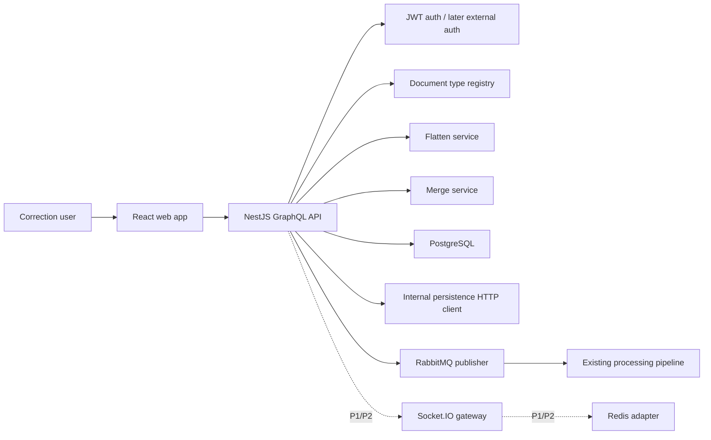
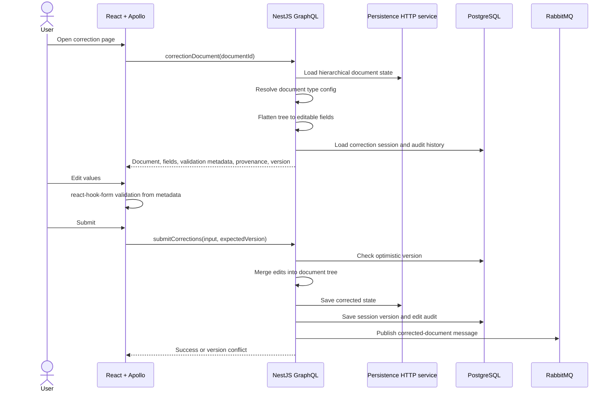
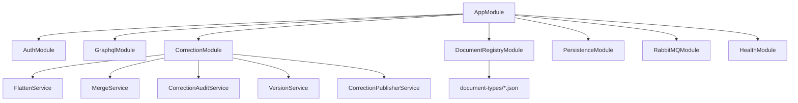
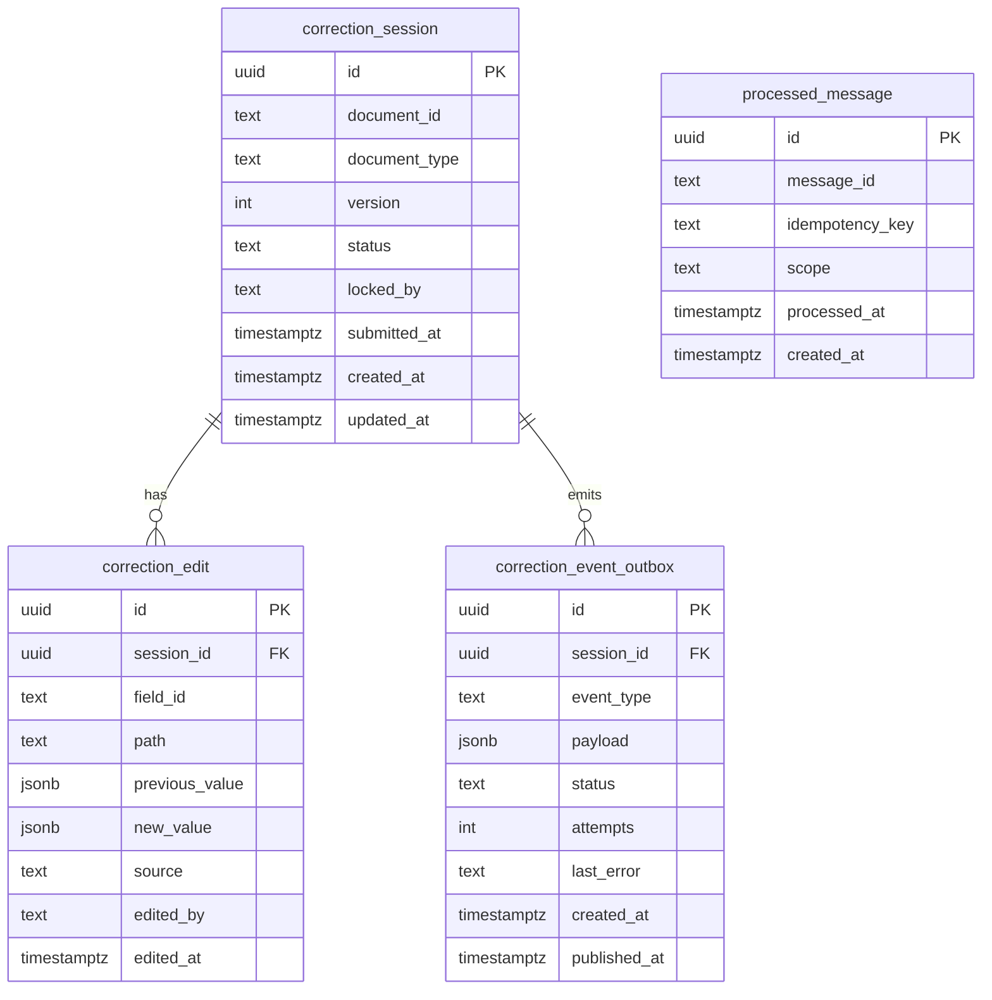
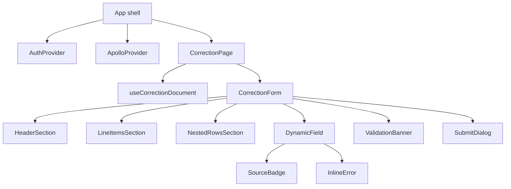

# Elemika Correction MVP General Plan

## 1. Project Overview

Elemika is a local-first MVP for reviewing, correcting, and submitting structured data extracted from supplier documents before it is delivered to a downstream system of record.

The core product is a web correction screen backed by a NestJS GraphQL monolith. The frontend receives server-supplied document metadata, renders dynamic forms for header fields, line items, and nested rows, validates user input, shows provenance and edit context, and submits corrected values. The backend resolves document type metadata, flattens hierarchical document state into editable field DTOs, applies edits back onto the document tree, persists correction/audit state, and publishes corrected document events to RabbitMQ.

The MVP should work locally first. Deployment, production observability, advanced collaboration, and multi-instance scaling should be deferred until the local FE/BE workflow is stable.

## 2. Desired Architecture



Recommended local dependency split:

- FE stack: `apps/web` with React, Material UI, react-hook-form, Apollo Client, Vitest, React Testing Library, Storybook, Playwright.
- BE stack: `apps/api` with NestJS, GraphQL, TypeORM, PostgreSQL, amqplib, Pino, Docker.
- Shared contracts: `packages/contracts` for generated GraphQL types, shared correction event types, and document metadata TypeScript types.
- Local infrastructure: keep FE and BE local stacks separate, as requested:
  - `apps/api/compose.local.yml` for API, PostgreSQL, RabbitMQ, optional Redis, and persistence-service stub.
  - Frontend local development runs directly through Vite; do not add FE Docker/Compose for Phase 0.
  - Keep frontend stage packaging compatible with static assets served from S3 + CloudFront.

## 3. Runtime Flow



## 4. GraphQL Contracts

Use schema-first NestJS GraphQL for the MVP. The SDL contract should live under `apps/api/src/graphql/schema/*.graphql`, and NestJS can generate local TypeScript definitions from SDL for resolver typing. This keeps the contract closer to the future Java/Spring backend implementation while still letting the MVP use NestJS for local development speed.

```graphql
scalar JSON

type Query {
  correctionDocument(id: ID!): CorrectionDocument!
  correctionDocumentTypes: [DocumentTypeSummary!]!
}

type Mutation {
  submitCorrections(input: SubmitCorrectionsInput!): SubmitCorrectionsPayload!
}

type CorrectionDocument {
  id: ID!
  documentType: String!
  version: Int!
  status: CorrectionStatus!
  schema: CorrectionSchema!
  fields: [CorrectionField!]!
  audit: [CorrectionAuditEntry!]!
}

type CorrectionSchema {
  documentType: String!
  version: Int!
  sections: [CorrectionSection!]!
}

type CorrectionSection {
  id: String!
  label: String!
  path: String!
  repeatable: Boolean!
  fields: [CorrectionFieldMetadata!]!
}

type CorrectionFieldMetadata {
  id: String!
  path: String!
  label: String!
  inputType: FieldInputType!
  required: Boolean!
  codeListKey: String
  validation: FieldValidation
}

type CorrectionField {
  id: ID!
  path: String!
  sectionId: String!
  rowPath: String
  label: String!
  value: JSON
  originalValue: JSON
  inputType: FieldInputType!
  required: Boolean!
  codeList: [CodeListOption!]
  validation: FieldValidation
  provenance: FieldProvenance
}

type FieldValidation {
  min: Float
  max: Float
  minLength: Int
  maxLength: Int
  pattern: String
  scale: Int
}

type FieldProvenance {
  source: ProvenanceSource!
  confidence: Float
  page: Int
  boundingBox: BoundingBox
  extractionModel: String
}

type CorrectionAuditEntry {
  id: ID!
  fieldId: String!
  path: String!
  previousValue: JSON
  newValue: JSON
  editedBy: String!
  editedAt: DateTime!
  source: CorrectionSource!
}

input SubmitCorrectionsInput {
  documentId: ID!
  expectedVersion: Int!
  edits: [CorrectionEditInput!]!
}

input CorrectionEditInput {
  fieldId: String!
  path: String!
  value: JSON
}

type SubmitCorrectionsPayload {
  documentId: ID!
  version: Int!
  status: CorrectionStatus!
  conflicts: [VersionConflict!]!
}
```

Core enums:

```graphql
enum CorrectionStatus {
  DRAFT
  READY_FOR_REVIEW
  SUBMITTED
  CONFLICTED
}

enum FieldInputType {
  TEXT
  DATE
  NUMBER
  CODE_LIST
}

enum ProvenanceSource {
  OCR
  EXTRACTION
  ENRICHMENT
  USER
}

enum CorrectionSource {
  USER_EDIT
  SYSTEM_MERGE
  REPROCESS
}
```

## 5. Backend Breakdown

Recommended NestJS modules:



Backend responsibilities:

- `CorrectionResolver`: GraphQL query and mutation boundary.
- `CorrectionService`: orchestration for load, validate, merge, persist, publish.
- `DocumentRegistryService`: loads document type definitions from config, validates registry shape at startup.
- `FlattenService`: converts hierarchical document tree into flat editable fields with stable `path` and `fieldId`.
- `MergeService`: applies submitted edits back onto the source tree and produces audit records.
- `VersionService`: enforces optimistic locking through `expectedVersion`.
- `PersistenceHttpClient`: wrapper for the existing internal persistence service. The real service is a black box, so local work should use a mock HTTP service in the backend Docker Compose stack. Phase 0 only needs that mock container to launch and expose health; document read/write behavior starts in Phase 1.
- `RabbitMQService`: low-level amqplib wrapper. Reuse the lifecycle/publish/consume pattern from `rd_shop`, but rename queues and remove order-specific assumptions.
- `CorrectionPublisherService`: publishes corrected document and reprocess requests.

## 6. Backend DB Schemas



Recommended indexes:

- `correction_session(document_id)` unique.
- `correction_session(document_type, status)`.
- `correction_edit(session_id, edited_at)`.
- `correction_event_outbox(status, created_at)`.
- `processed_message(message_id)` unique.
- `processed_message(idempotency_key)` unique where not null.

## 7. Document Registry Schema

```ts
export type DocumentTypeConfig = {
  type: string;
  version: number;
  label: string;
  sections: DocumentSectionConfig[];
};

export type DocumentSectionConfig = {
  id: string;
  label: string;
  path: string;
  repeatable: boolean;
  fields: DocumentFieldConfig[];
};

export type DocumentFieldConfig = {
  id: string;
  path: string;
  label: string;
  inputType: 'text' | 'date' | 'number' | 'code-list';
  required?: boolean;
  codeListKey?: string;
  validation?: {
    min?: number;
    max?: number;
    minLength?: number;
    maxLength?: number;
    pattern?: string;
    scale?: number;
  };
};
```

Example document config:

```json
{
  "type": "supplier_invoice",
  "version": 1,
  "label": "Supplier Invoice",
  "sections": [
    {
      "id": "header",
      "label": "Header",
      "path": "$.header",
      "repeatable": false,
      "fields": [
        {
          "id": "invoiceNumber",
          "path": "$.header.invoiceNumber",
          "label": "Invoice number",
          "inputType": "text",
          "required": true
        }
      ]
    },
    {
      "id": "lineItems",
      "label": "Line items",
      "path": "$.lineItems[*]",
      "repeatable": true,
      "fields": [
        {
          "id": "lineAmount",
          "path": "$.amount",
          "label": "Amount",
          "inputType": "number",
          "required": true,
          "validation": { "min": 0, "scale": 2 }
        }
      ]
    }
  ]
}
```

## 8. Message Contracts

Corrected document event:

```ts
export type CorrectedDocumentEvent = {
  eventId: string;
  eventType: 'document.corrected';
  documentId: string;
  documentType: string;
  correctionSessionId: string;
  version: number;
  correctedBy: string;
  correctedAt: string;
  idempotencyKey: string;
};
```

Replay/reprocess request:

```ts
export type ReprocessDocumentCommand = {
  commandId: string;
  commandType: 'document.reprocess.requested';
  documentId: string;
  documentType: string;
  requestedBy: string;
  requestedAt: string;
  reason: 'correction_submitted';
  idempotencyKey: string;
};
```

Queue recommendation:

- `correction.completed`: durable queue or exchange route for corrected documents.
- `document.reprocess.requested`: durable queue for pipeline reprocessing.
- `correction.dlq`: dead-letter queue for unprocessable correction events.

## 9. Frontend Breakdown



Frontend responsibilities:

- Fetch `CorrectionDocument` by document id.
- Convert backend metadata into a runtime validation schema for `react-hook-form`.
- Render fields by metadata type:
  - `TEXT`: MUI `TextField`.
  - `DATE`: MUI date input or MUI X Date Picker if accepted as dependency.
  - `NUMBER`: numeric text field with parsing and scale handling.
  - `CODE_LIST`: MUI `Select` / `Autocomplete`.
- Render header as compact grouped form fields.
- Render line items and nested rows as dense editable tables.
- Show inline validation errors from client metadata validation and server mutation response.
- Show provenance badges and edit history where metadata is available.
- Submit only changed fields, with `expectedVersion`.

Frontend schemas:

```ts
export type CorrectionFormValues = {
  documentId: string;
  version: number;
  fields: Record<string, unknown>;
};

export type FieldViewModel = {
  key: string;
  fieldId: string;
  path: string;
  sectionId: string;
  rowPath?: string;
  label: string;
  value: unknown;
  originalValue: unknown;
  inputType: 'TEXT' | 'DATE' | 'NUMBER' | 'CODE_LIST';
  required: boolean;
  options?: Array<{ value: string; label: string }>;
  validation?: FieldValidationViewModel;
  provenance?: FieldProvenanceViewModel;
};
```

## 10. Auth Flow

The correction-flow critical path only needs local JWT auth.

External provider auth is intentionally moved to a later dedicated phase after the backend correction flow, frontend correction UX, and FE-BE integration are already stable.

Reference: `docs/phase-6-google-oidc-auth-plan.md`.

Recommended split:

- Local MVP default: simple JWT signup/signin against the backend, using an access token in memory.
- Later external-auth phase: start with Google-only sign-in and keep GraphQL on Elemika-issued JWTs.
- Keep the backend auth guard abstraction clean so local JWT and later external-auth entrypoints can still converge on the same GraphQL user context.
- Refresh token flow is deferred. Phase 1 only needs short-lived access tokens and explicit re-login.

Reuse from `rd_shop`:

- Bearer token extraction pattern from `JwtStrategy`.
- `GqlJwtAuthGuard` pattern for GraphQL request context.
- Role/scope decorators concept.

Simplify from `rd_shop`:

- Drop email verification.
- Drop password reset tokens.
- Drop mail module.
- Drop audit-log module for auth events.
- Keep Pino request logging only.
- Ensure roles/scopes guards support GraphQL execution context, because current `rd_shop` role/scope guards read only `context.switchToHttp()`.

## 11. Monorepo Setup

Current repo setup uses plain npm workspaces. Turborepo was evaluated early and intentionally dropped because the current repository size does not justify another orchestration layer yet.

Current structure:

```text
apps/
  api/
    .env.example
    .env.local
    Dockerfile.dev
    compose.local.yml
    nest-cli.json
    package.json
    scripts/docker/
    src/
  web/
    .env.example
    .env.local
    package.json
    src/
    vite.config.ts
mocks/
  persistence-service/
    Dockerfile.dev
    package.json
    src/
docs/
  general-plan.md
  phase-0-project-setup-plan.md
  phase-1-backend-foundation-plan.md
  requirements-raw.md
package.json
package-lock.json
tsconfig.base.json
```

Current root scripts are intentionally limited to shared repository tooling only:

```json
{
  "scripts": {
    "format": "prettier --write \"{apps,mocks,docs}/**/*.{ts,tsx,js,mjs,json,md,yml,yaml}\" \"*.{json,md,yml,yaml}\"",
    "lint": "eslint \"apps/**/*.{ts,tsx,js}\" --fix",
    "lint:ci": "eslint \"apps/**/*.{ts,tsx,js}\"",
    "prepare": "husky"
  }
}
```

Workspace ownership is explicit:

- `apps/api` owns NestJS dev/build/database/Docker scripts.
- `apps/web` owns Vite dev/build/preview scripts.
- `mocks/persistence-service` stays local-only and is only used by the backend Docker stack.

Recommended path forward:

- Keep plain npm workspaces until cross-workspace orchestration becomes painful.
- Add a shared package only once GraphQL contracts or shared event types actually stabilize.
- Revisit Turborepo later only if CI/runtime coordination becomes a real bottleneck.

## 12. P0/P1/P2 Priorities

### Backend

P0 (completed baseline):

- NestJS monolith scaffold with Nest CLI.
- Environment validation and app-local env files.
- Pino logger wiring.
- CORS helper and health endpoint.
- TypeORM module/data-source bootstrap and local DB CLI scripts.
- Local Docker Compose stack for API, PostgreSQL, RabbitMQ, and persistence mock.
- Persistence mock container baseline.

P1 (current next phase):

- Schema-first GraphQL module.
- First SDL files and generated TypeScript definitions.
- Document registry config loading and startup validation.
- Persistence HTTP client interface plus in-memory mock read/write behavior.
- RabbitMQ connection wrapper module.
- Local JWT signup/signin plus `me` query.
- `User` and `correction_session` migrations.
- Correction-session open/save-draft foundation.

P2:

- Correction query/mutation flow.
- Flatten and merge services.
- Optimistic version enforcement for correction edits.
- Audit trail and outbox/event publishing.
- Replay/reprocess orchestration.

### Frontend

P0 (completed baseline):

- Vite app shell.
- React Router shell.
- Material UI baseline layout.
- App-local env files.
- Local dev/build workflow.

P1:

- Apollo Client setup.
- Auth provider for local JWT mode.
- Correction route shell backed by the first stable API contract.
- Loading, empty, error, unauthorized, and conflict states.

P2:

- Metadata-driven dynamic form renderer.
- Header, line-item, and nested-row sections.
- react-hook-form integration and submit flow.
- Provenance and edit-history UI.
- Component/integration coverage for shipped correction UI.

## 13. Deferred Features

### WebSockets + Redis

Socket.IO fits the product, but not as a P0 dependency. GraphQL should remain the source of truth for loading and submitting corrections.

Good P1/P2 real-time use cases:

- Notify the current user that reprocessing started/completed/failed.
- Notify another open tab that document version changed.
- Show soft locks or "being reviewed by" state.
- Later, presence and field-level collaboration.

Suggested event model:

```ts
export type ClientToServerEvents = {
  'document:join': { documentId: string };
  'document:leave': { documentId: string };
};

export type ServerToClientEvents = {
  'document:locked': { documentId: string; lockedBy: string };
  'document:versionChanged': { documentId: string; version: number };
  'correction:saved': { documentId: string; version: number };
  'pipeline:status': {
    documentId: string;
    status: 'queued' | 'processing' | 'completed' | 'failed';
    message?: string;
  };
};
```

Local recommendation:

- P0: no WebSocket; use GraphQL mutation response and optional polling.
- P1: add Socket.IO gateway with in-memory adapter.
- P2: add Redis adapter once multiple API instances or stage scaling require cross-instance room broadcasts.

### Production-grade observability

Defer AWS metrics, CloudWatch EMF, custom observability modules, and advanced event loop monitoring. Keep Pino request logs, error logs, health endpoints, and CI test artifacts.

### Full auth lifecycle

Defer reset password, email confirmation, mail delivery, and auth audit logs. The correction MVP needs secure access, not a full customer account platform.

## 14. rd_shop Reuse Analysis

Scanned source: `/Users/ichernob/Desktop/learn/r_d/rd_shop`, skipping `.temp/` and `demo/`.

### Strong candidates to reuse as references

Backend bootstrap:

- `apps/shop/src/main.ts` has useful setup for global prefix, versioning, validation pipe, global exception filter, response-time interceptor, Pino logger hookup, CORS, Helmet, Swagger in non-production, and graceful shutdown.
- For Elemika, reuse the shape but remove event-loop monitoring unless needed later.

App module composition:

- `apps/shop/src/app.module.ts` shows clean Nest module composition with global config, Pino, TypeORM, throttling, GraphQL, RabbitMQ, health.
- For Elemika, keep the monolith module layout but avoid `apps/*` backend nesting inside the API source. The prompt says backend should be a monolith, so put modules under `apps/api/src/*`, not `apps/api/src/apps/*` or `libs/*` backend modules.

GraphQL:

- `apps/shop/src/graphql/graphql.module.ts` is a useful Apollo/Nest module reference, but Elemika should use schema-first SDL instead of copying the code-first schema style.
- `apps/shop/src/graphql/schemas/*`, `inputs/*`, `resolvers/*`, and `loaders/*` are useful references for object types, input validation, resolver structure, and DataLoader.
- For Elemika, create correction-specific schemas instead of generic shop/order types.

Auth:

- `apps/shop/src/auth/jwt.strategy.ts`, `guards/gql-jwt-auth.guard.ts`, decorators, and permissions constants are useful references.
- Simplify heavily: keep bearer auth, roles/scopes if useful, and token service only if local JWT login is required.
- Do not bring password reset, email verification, mail, or auth audit logging into MVP.
- Adjust guards/decorators for GraphQL context where needed.

Users:

- `apps/shop/src/users/user.entity.ts` is a useful reference for UUID entity style, indexes, timestamps, roles, scopes.
- For Elemika, the Phase 1 `User` entity should include `id`, `email`, `passwordHash`, `displayName`, `roles`, `scopes`, timestamps. If OIDC later becomes primary, external identity fields can be added without changing the exposed GraphQL `User` shape.

Common/config/core:

- `apps/shop/src/core/environment/*` and `libs/common/src/environment/validate.ts` are strong references for class-validator based env validation.
- `apps/shop/src/config/logger.ts` is a good Pino baseline with request id and redaction.
- `apps/shop/src/core/cors`, `helmet`, `process`, and `swagger` are reusable as references.
- Since the new app should avoid a BE `libs/` layout, copy/adapt only the patterns into `apps/api/src/core` or `apps/api/src/common`.

Database:

- `apps/shop/src/config/typeORM.ts`, `apps/shop/src/data-source.ts`, and `libs/common/src/database/*` are good references for TypeORM options, adapter pattern, migrations, and custom logging.
- For MVP, use direct PostgreSQL config first. The full adapter registry is useful but may be overbuilt unless multiple DB providers are actually needed.

RabbitMQ:

- `apps/shop/src/rabbitmq/rabbitmq.service.ts`, `rabbitmq.module.ts`, and `processed-message.entity.ts` are strong references for lifecycle, durable queues, manual ack, prefetch, persistent publishing, and idempotency tracking.
- Adapt names and queue topology to correction/reprocess events.
- Keep DLQ support.

Files:

- `apps/shop/src/files/*` is useful only if the correction UI needs uploaded source documents or PDF assets in MVP.
- If supplier document files are already managed by the persistence service, defer local file storage.

Docker and compose:

- `Dockerfile`, `Dockerfile.dev`, `apps/shop/compose.dev.yml`, and `apps/shop/compose.yml` are useful references for multi-stage Node/Nest builds, non-root users, local dependencies, migrations, seed jobs, and health-gated dependencies.
- For Elemika, create separate API and web Dockerfiles/compose files. Do not mix FE and BE local/deployment stacks.
- Keep Postgres/RabbitMQ local services. Add Redis only when WebSocket status events become P1.

GitHub Actions:

- `.github/workflows/pr-checks.yml` is a strong reference for install, lint, type-check, tests, Docker preview build, and a single required sentinel job.
- `.github/workflows/build-and-push.yml` and `deploy-stage.yml` are useful references for artifact-first deploys and stage environment separation, but the AWS/Pulumi specifics are more than this MVP needs initially.
- `.github/actions/code-quality/action.yml` is reusable conceptually, but remove proto checks unless this project adds protobuf.

### Pieces to avoid for MVP

- Payments/gRPC/proto flow.
- Audit-log module.
- Mail module.
- Password reset and email verification entities.
- Product/cart/order domain modules.
- AWS S3/SES/CloudWatch-specific code.
- Advanced performance test stack.
- Pulumi production deployment setup.
- Multi-service Nest app layout from `apps/shop` + `apps/payments`.

## 15. Implementation Phases

This is a planning sequence, not a task checklist.

Phase 0 - Project setup (completed):

- Plain npm workspaces with pinned Node/npm versions.
- `apps/api` and `apps/web` established with app-local env files.
- Nest CLI based API scaffold with config validation, Pino, TypeORM bootstrap, health, and local Docker stack.
- Vite frontend shell with React Router and Material UI.
- Local persistence mock container that exposes health only.

Reference: `docs/phase-0-project-setup-plan.md`.

Phase 1 - Backend foundation (next step):

- Add schema-first GraphQL foundation.
- Add first SDL files and generated resolver types.
- Add document registry loading and startup validation.
- Add persistence HTTP client boundary plus an in-memory mock service with read/write behavior.
- Add RabbitMQ wrapper module.
- Add local JWT signup/signin flow, `me` query, and GraphQL auth types/resolvers.
- Add first real migrations for `user` and `correction_session`.
- Add correction-session open/save-draft foundation backed by `correction_session`.

Reference: `docs/phase-1-backend-foundation-plan.md`.

Phase 2 - Backend correction flow:

- Implement `correctionDocument` and `submitCorrections` boundaries.
- Add flatten/merge services.
- Add optimistic locking, audit records, and first publish flow.

Reference: `docs/phase-2-backend-correction-flow-plan.md`.

Phase 3 - Frontend foundation:

- Part 1: backend auth/inbox additions plus frontend foundations.
- Add Apollo Client, GraphQL Code Generator client preset, MSW runtime mocking, and i18next.
- Add auth provider with sign-in, sign-up, and sign-out flows.
- Add `/corrections` inbox foundation before the detailed workspace route.
- Part 2: correction workspace shell, design-system mapping, and Storybook.

Reference: `docs/phase-3-frontend-foundation-plan.md`.

Phase 4 - Frontend correction UX:

- Build metadata-driven form rendering.
- Add header, line-item, and nested-row sections.
- Add submit flow, validation banner, provenance, and edit-history UI.

Reference: `docs/phase-4-frontend-correction-ux-plan.md`.

Phase 5 - Integration hardening:

- Connect FE and BE against the real local GraphQL contract.
- Add API integration tests and frontend component/integration tests.
- Add a minimal Playwright happy path.
- Add stage packaging and smoke checks.

Phase 6 - Google external auth:

- Deliver only after the full correction flow is stable end to end.
- Add Google sign-in through backend-managed OAuth/OIDC code exchange.
- Keep GraphQL on Elemika-issued JWTs.

Reference: `docs/phase-6-google-oidc-auth-plan.md`.

Phase 7 - Deferred enhancements:

- Consumer-side idempotency with `processed_message` once a real worker/replay flow exists.
- Replay/reprocess orchestration.
- Socket.IO status events.
- Redis adapter if multi-instance scaling is introduced.
- Conflict reconciliation improvements.

Should BE and FE be implemented together?

- Phase 1 remains backend-first because the first stable GraphQL contract, persistence boundary, and registry model do not exist yet.
- The frontend already has a running shell, so frontend foundation work can begin as soon as the first stable GraphQL query shape is available.
- Once the initial query contract is stable, backend and frontend can proceed in parallel without waiting for the full correction workflow.

## 16. CI/CD Strategy

No production pipeline is needed yet; target PR checks first and a later stage deployment.

### PR checks

Use one workflow with separate jobs:

- `npm ci` with the pinned root toolchain.
- `npm run lint:ci`.
- `npm --workspace apps/api run build`.
- `npm --workspace apps/web run build`.
- API unit/integration tests once Phase 1/2 add them.
- Web unit/component tests once Phase 3/4 add them.
- Docker preview build for `apps/api/Dockerfile.dev`.
- Optional preview build for `mocks/persistence-service/Dockerfile.dev` to catch local mock regressions.

### Stage build

On merge to `development`:

- Build and tag the API container image.
- Build the web static bundle from `apps/web`.
- Publish a release manifest that points to the API image and web static artifact.

### Stage deploy

Keep stage deployment simple:

- Run API migrations before the new API container starts.
- Deploy the API container independently.
- Upload the web static build to the chosen stage hosting target (S3 + CloudFront remains the preferred path).
- Run smoke checks:
  - API `/health`.
  - GraphQL endpoint availability once Phase 1 introduces it.
  - Web root route loads.

### Per-stack separation

- API owns its own env files, Docker image, migration job, and smoke checks.
- Web owns its own env files and static build artifact flow.
- The persistence mock remains local-development only and should not be part of the stage deployment surface.
