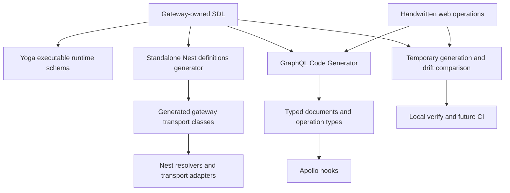

# AspectLoop GraphQL Model

Status: Active  
Last updated: 2026-08-16

## 1. Purpose

This document defines the ownership, generation, runtime consumption, and
verification model for AspectLoop's public GraphQL contract. It complements the
transport decision in `docs/decisions/0001-graphql-http-transport.md` and the
high-level contract principles in `docs/general-plan.md`.

AspectLoop is schema-first. Handwritten SDL is authoritative; generated
TypeScript is derived, tracked, and never edited by hand.

## 2. Model At A Glance



The runtime schema and generated TypeScript have a common source, but different
jobs:

- Yoga executes the SDL contract at runtime.
- Gateway definitions type the Nest transport boundary.
- Web artifacts type the operations actually selected by the browser.
- The drift checker proves that tracked generated artifacts match their inputs.

## 3. Ownership

- **Gateway SDL:** `apps/gateway-api/src/graphql/schema/**/*.graphql` is
  gateway-owned source consumed by Yoga and both generators.
- **Gateway definitions:**
  `apps/gateway-api/src/graphql/generated/graphql.types.ts` is derived output
  consumed by resolvers and transport adapters.
- **Web operations:** GraphQL documents in `apps/web/src/graphql/hooks/**` are
  web-owned source consumed by the web generator.
- **Web artifacts:** `apps/web/src/graphql/generated/**` is derived output
  consumed by Apollo hooks.
- **Drift checker:** `scripts/graphql/check-generated.mjs` is repository quality
  infrastructure consumed by local verification and future CI.

Generated directories are tracked so contract changes remain reviewable and a
checkout can type-check without an implicit generation step. They are excluded
from ESLint and Prettier because their generators own their format.

## 4. Public SDL

The gateway divides the current contract by capability:

- `base.graphql`: root query/mutation declarations and shared scalars;
- `auth.graphql`: user, authentication payloads, and auth operations;
- `document-types.graphql`: available correction-document type summaries;
- `correction-session.graphql`: correction session query and draft operations;
- `correction-document.graphql`: correction document, provenance, validation,
  and submit contract.

Adding a new public capability starts with the owning SDL file. Do not define
the public API through TypeScript decorators and do not copy the schema into the
web workspace.

## 5. Gateway Runtime Consumption

`apps/gateway-api/src/graphql/graphql.module.ts` gives Yoga the SDL paths:

```text
development/test -> src/graphql/schema/**/*.graphql
stage/production -> dist/graphql/schema/**/*.graphql
```

Yoga builds and sorts the executable schema during gateway startup. The gateway
generated TypeScript file does not construct that schema. Starting the gateway
also does not generate or rewrite tracked files.

Resolvers bind SDL operation names to Nest methods and use generated classes at
the transport boundary. Authentication, authorization, error masking, and
request context remain runtime concerns and are not encoded in generated types.

## 6. Gateway Definition Generation

The standalone generator:

```text
apps/gateway-api/scripts/generate-graphql-definitions.mjs
```

performs this sequence:

1. Load and merge all gateway SDL files.
2. Build the schema, failing on invalid or conflicting definitions.
3. Sort the schema lexicographically for deterministic output.
4. Generate NestJS class definitions.
5. Write `apps/gateway-api/src/graphql/generated/graphql.types.ts`.

Run only this producer with:

```bash
npm run graphql:generate:gateway
```

The command does not bootstrap NestJS and does not require PostgreSQL,
RabbitMQ, a listening port, or a running Compose stack.

## 7. Web Operation Generation

Web hooks own their query and mutation documents. GraphQL Code Generator checks
those documents against the gateway SDL and emits:

```text
apps/web/src/graphql/generated/
  fragment-masking.ts
  gql.ts
  graphql.ts
  index.ts
```

These files provide operation input/result types, typed document nodes, the
generated `graphql()` lookup, and fragment utilities. Apollo hooks consume the
generated documents; application components consume the hooks rather than raw
GraphQL transport details.

Run only this producer with:

```bash
npm run graphql:generate:web
```

The canonical root command forces `GQL_CODEGEN_LOCAL_SCHEMA=true`. This ignores
`GQL_SCHEMA_URL` and makes tracked output reproducible from the repository SDL.

Direct workspace codegen may intentionally use `GQL_SCHEMA_URL` to inspect a
running local, stage, or future Java backend:

```bash
npm run graphql-codegen --workspace @aspectloop/web
```

Remote generation is a compatibility workflow, not the canonical producer for
tracked artifacts. Review its output and do not commit an accidental remote
schema divergence.

## 8. Canonical Change Workflow

After changing SDL or a web operation, run:

```bash
npm run graphql:generate
npm run graphql:check
```

`graphql:generate` executes gateway generation before web generation. Review
and commit generated changes with their handwritten source changes.

Expected impact:

- An SDL input, output, or enum change updates gateway definitions and updates
  web artifacts when selected operations are affected.
- A new SDL field unused by the web updates gateway definitions only.
- A web selection or operation change updates web artifacts only.
- A resolver implementation change without a contract change produces no
  generated output.
- A domain or persistence refactor behind the same contract produces no
  generated output.

## 9. Non-Mutating Drift Gate

`npm run graphql:check` creates an owned operating-system temporary directory
and generates both artifact sets there. It compares temporary and tracked file
sets and contents, normalizing line endings only, then removes the temporary
directory.

The checker never invokes a write-mode generator against tracked output paths.
It fails for missing, unexpected, or content-different generated files and
directs the developer to run `npm run graphql:generate`.

The check is part of `npm run verify` and therefore `npm run verify:full`. It is
also the contract intended for the M03-B pull-request workflow.

## 10. Boundary Rules

Generated GraphQL types are transport models, not domain models.

- Resolvers may accept generated inputs and return structurally compatible
  generated output shapes.
- Resolvers or transport adapters should add trusted request context and map
  inputs into service-owned commands.
- Application services should own framework-neutral commands and result views.
- Persistence entities, internal HTTP contracts, RabbitMQ events, and AI
  provider payloads must not depend on generated GraphQL types.
- The web must not import gateway TypeScript internals; it depends on SDL and
  generated operation artifacts only.

Some current gateway services still consume generated GraphQL classes directly.
That is retained PoC debt, not the target boundary. Correction/auth hardening
should move those imports back to resolvers or adapters without changing the
public SDL unnecessarily.

## 11. Compatibility With A Future Java Gateway

The public contract is portable because it is represented as SDL rather than
NestJS decorators or TypeScript-only models. A future Java/Spring gateway can
implement the same schema while the web continues to generate from that
contract.

Migration should compare SDL compatibility and operation behavior, not copy
NestJS generated classes into Java. `GQL_SCHEMA_URL` can support explicit remote
compatibility checks, while repository-local SDL remains authoritative until a
separate ownership decision changes it.

## 12. Failure Interpretation

- **Gateway generation fails:** the SDL cannot be merged, built, or emitted.
  Fix the handwritten SDL.
- **Web generation fails:** an operation is invalid against the selected schema.
  Fix the operation or make an intentional SDL change.
- **`graphql:check` reports drift:** tracked generated output is stale. Run
  `npm run graphql:generate` and review the diff.
- **Gateway starts but an operation fails:** a runtime resolver, guard, service,
  or infrastructure problem exists. Generation is not the cause by default.
- **Remote codegen differs from local:** backend contracts have diverged. Review
  compatibility before changing repository authority.
