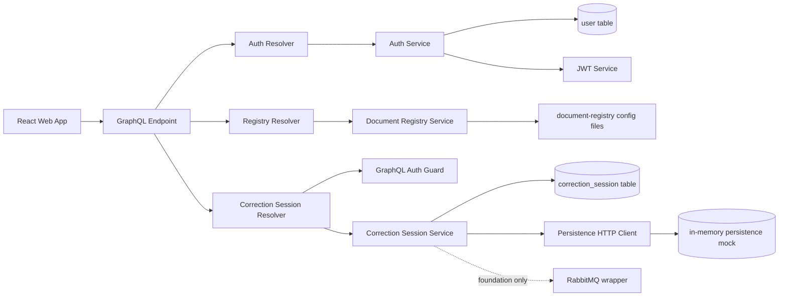
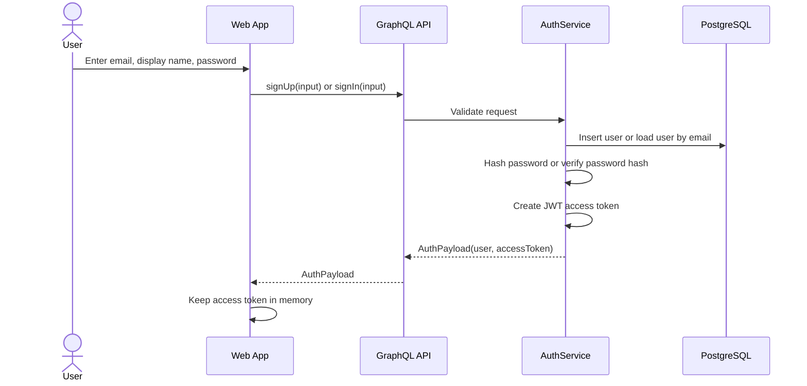
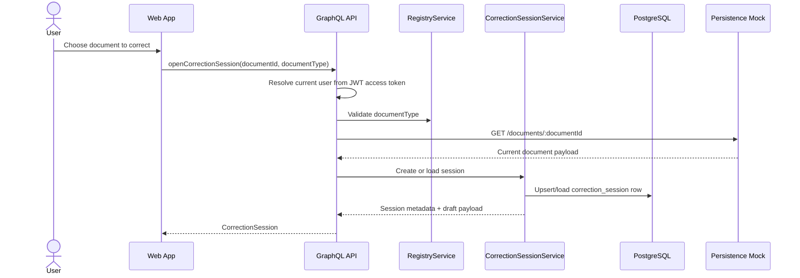
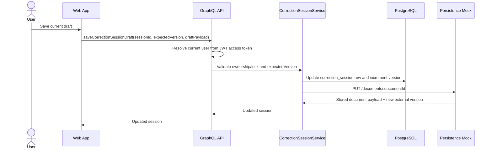
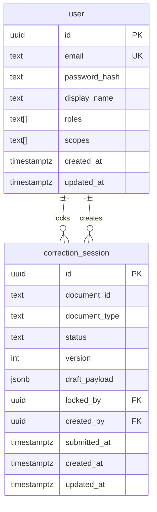

# Phase 1 Backend Foundation Implementation Plan

> Reference repo: `/Users/ichernob/Desktop/learn/r_d/rd_shop` (skip `.temp` and `demo`).

## Goal

Turn the current local NestJS scaffold into the first real backend foundation for the correction MVP.

Phase 1 should establish the backend building blocks that later phases depend on:

- Schema-first GraphQL.
- Local JWT signup/signin.
- `User` and `correction_session` persistence.
- Registry-driven document metadata.
- Persistence service boundary backed locally by an in-memory mock.
- RabbitMQ connection wrapper.

Phase 1 is still not the full correction workflow. It should stop at auth, document-type discovery, session creation/loading, and draft persistence.

## Current Baseline Already Done

The repository already has the following in place from Phase 0:

- Plain npm workspaces.
- Node/npm toolchain pinning.
- App-local env files for `apps/api` and `apps/web`.
- Nest CLI based API scaffold.
- Config validation, Pino logging, CORS helper, and `/health` endpoint.
- TypeORM module bootstrap and CLI `DataSource`.
- Local Docker Compose stack with PostgreSQL, RabbitMQ, API, and persistence mock.
- Frontend Vite shell.

Phase 1 should build on this baseline, not replace it.

## Scope

Phase 1 must deliver:

- Schema-first GraphQL module wired into NestJS.
- SDL files and generated TypeScript definitions committed in the repo.
- `User` entity and `correction_session` entity with real migrations.
- Local JWT signup/signin flow with `me` query.
- Document registry config loading and startup validation.
- Persistence HTTP client interface.
- In-memory persistence mock with document read/write behavior.
- Correction-session open/load/save-draft foundation backed by `correction_session`.
- RabbitMQ wrapper module with connection lifecycle only.

Phase 1 must not deliver:

- Refresh token flow.
- Password reset, email confirmation, or mail delivery.
- Full flattened `correctionDocument` query.
- `submitCorrections` mutation.
- Flatten/merge services.
- Audit trail and outbox logic.
- RabbitMQ idempotency / `processed_message` persistence.
- Frontend Apollo wiring.
- Replay/reprocess flow.

## Exit Criteria

Phase 1 is complete when all of the following are true:

- The API exposes a working GraphQL endpoint backed by SDL files.
- Resolver typings are generated from SDL.
- `signUp`, `signIn`, and `me` work with local JWT access tokens.
- `correctionDocumentTypes` returns registry-backed data.
- The persistence mock stores documents in memory and supports read/write round-trips.
- `openCorrectionSession` can create or load a session for a document.
- `saveCorrectionSessionDraft` updates both session metadata and the in-memory document payload.
- Real migrations exist for `user` and `correction_session`.
- RabbitMQ wrapper can connect successfully, even if no correction-specific publisher exists yet.

## Human-Readable Backend Flow

### Runtime overview



### Phase 1 request flow

The Phase 1 backend should work like this:

1. A user signs up or signs in through GraphQL.
2. The API validates credentials against the `user` table and returns a JWT access token.
3. The web app stores that access token in memory and sends it as `Authorization: Bearer <token>` on later GraphQL requests.
4. Auth-protected resolvers use a GraphQL JWT guard to resolve the current user.
5. The web app asks for available document types from the registry.
6. The web app opens a correction session for a document id and document type.
7. The API validates the requested document type, loads the current document payload from the persistence mock, and creates or reuses a `correction_session` row.
8. The API returns session metadata plus the current draft/source payload needed by the frontend shell.
9. When the user saves a draft, the API updates the `correction_session` row, increments the session version, and writes the latest document payload back to the in-memory persistence mock.
10. RabbitMQ is initialized and available, but no correction-specific publish flow is required yet.

### Sequence 1: signup/signin



### Sequence 2: open correction session



### Sequence 3: save draft



## Human-Readable GraphQL Schema for Phase 1

Phase 1 should expose a small but complete contract.

```graphql
type User {
  id: ID!
  email: String!
  displayName: String!
  roles: [String!]!
  scopes: [String!]!
  createdAt: DateTime!
  updatedAt: DateTime!
}

type AuthPayload {
  accessToken: String!
  user: User!
}

type DocumentTypeSummary {
  type: String!
  version: Int!
  label: String!
}

type CorrectionSession {
  id: ID!
  documentId: ID!
  documentType: String!
  status: String!
  version: Int!
  draftPayload: JSON!
  lockedBy: User!
  createdAt: DateTime!
  updatedAt: DateTime!
}

input SignUpInput {
  email: String!
  password: String!
  displayName: String!
}

input SignInInput {
  email: String!
  password: String!
}

input OpenCorrectionSessionInput {
  documentId: ID!
  documentType: String!
}

input SaveCorrectionSessionDraftInput {
  sessionId: ID!
  expectedVersion: Int!
  draftPayload: JSON!
}

type Query {
  me: User
  correctionDocumentTypes: [DocumentTypeSummary!]!
  correctionSession(sessionId: ID!): CorrectionSession!
}

type Mutation {
  signUp(input: SignUpInput!): AuthPayload!
  signIn(input: SignInInput!): AuthPayload!
  openCorrectionSession(input: OpenCorrectionSessionInput!): CorrectionSession!
  saveCorrectionSessionDraft(input: SaveCorrectionSessionDraftInput!): CorrectionSession!
}
```

This contract is intentionally smaller than the eventual Phase 2/3 correction schema. It gives the frontend enough to authenticate, discover document types, open a working session, and save drafts without introducing flatten/merge complexity too early.

## Human-Readable Data Schema for Phase 1

Phase 1 should persist only the data needed for auth and draft session state.



Recommended table meaning:

- `user`: local-auth identity used by the JWT flow.
- `correction_session`: one working draft per document, carrying the current JSON payload and optimistic version.

Why `documentId` and `documentType` stay as plain text/string fields in `correction_session`:

- `documentId` is an external identifier owned by the persistence service, not by the correction database. The correction service only references that external document.
- `documentType` is a stable registry key such as `supplier_invoice`, not a local lookup-table identity. In Phase 1 the application validates it against the registry, so a database enum is not required.
- Keeping both as strings preserves the integration boundary: the correction service does not claim ownership of external document identity or type taxonomy.
- Using a database enum for `documentType` would force a DB migration every time a new supported type is added. For a config-driven registry, that coupling is unnecessary early on.

Recommended indexes:

- `user(email)` unique.
- `correction_session(document_id)` unique.
- `correction_session(document_type, status)`.
- `correction_session(locked_by, updated_at)`.

Why keep `draft_payload` directly on `correction_session` in Phase 1:

- It is the smallest schema that supports open/load/save-draft.
- It avoids inventing `correction_edit` and outbox tables before the merge/audit model is ready.
- Phase 2 can normalize edits and events once the correction workflow is stable.

## Task 1: Schema-First GraphQL Module

**Goal:** introduce a complete but small GraphQL platform for auth, document-type discovery, and draft session management.

**Suggested files:**

- `apps/api/src/graphql/graphql.module.ts`
- `apps/api/src/graphql/schema/base.graphql`
- `apps/api/src/graphql/schema/auth.graphql`
- `apps/api/src/graphql/schema/document-types.graphql`
- `apps/api/src/graphql/schema/correction-session.graphql`
- `apps/api/src/graphql/graphql.types.ts` (generated)
- `apps/api/src/graphql/resolvers/auth.resolver.ts`
- `apps/api/src/graphql/resolvers/document-types.resolver.ts`
- `apps/api/src/graphql/resolvers/correction-session.resolver.ts`

**Implementation notes:**

- Use schema-first SDL files under `src/graphql/schema`.
- Generate TypeScript definitions from SDL into a committed file inside `src/graphql`.
- Keep resolvers thin and move orchestration into domain services.

## Task 2: Document Registry Foundation

**Goal:** make document metadata configuration-driven and validated at startup.

**Suggested files:**

- `apps/api/src/document-registry/document-registry.module.ts`
- `apps/api/src/document-registry/document-registry.service.ts`
- `apps/api/src/document-registry/document-registry.types.ts`
- `apps/api/src/document-registry/document-registry.validation.ts`
- `apps/api/src/document-registry/configs/supplier_invoice.json`

**Implementation notes:**

- Load JSON configs from a dedicated configs folder.
- Validate registry shape at startup and fail fast on invalid config.
- Expose summary objects for `correctionDocumentTypes`.
- Keep only one sample document type in Phase 1.

Why registry types live in config files in Phase 1:

- Yes, this is intentional. The MVP assumes a predefined set of supported document types controlled by the backend codebase.
- Adding a new supported type should be a product/deployment decision, not a runtime user action.
- Config files are the simplest way to version, review, and test document-type definitions alongside the code that uses them.
- If the business later needs tenant-managed or admin-managed document types, the registry can move to database-backed storage without changing the meaning of `documentType` as an external key.

## Task 3: Persistence Boundary + In-Memory Mock

**Goal:** establish the HTTP integration boundary and make the local mock useful for the session flow.

**Suggested files:**

- `apps/api/src/persistence/persistence.module.ts`
- `apps/api/src/persistence/persistence.client.ts`
- `apps/api/src/persistence/persistence.types.ts`
- `apps/api/src/persistence/interfaces.ts`
- `mocks/persistence-service/src/server.mjs` (extend)

**Required mock behavior:**

- `GET /health`
- `GET /documents/:documentId`
- `PUT /documents/:documentId`

**Recommended in-memory model:**

- Store documents in a process-local `Map<string, StoredDocument>`.
- Seed one or more known documents at service startup.
- Return `404` when the requested document does not exist.
- Increment an external document version on every `PUT`.

**Recommended stored shape:**

```ts
type StoredDocument = {
  documentId: string;
  documentType: string;
  version: number;
  payload: Record<string, unknown>;
  updatedAt: string;
};
```

**Phase 1 constraint:**

- The mock should behave like a tiny in-memory document store.
- It should not try to emulate the full external persistence service.

## Task 4: RabbitMQ Foundation Module

**Goal:** add a reusable RabbitMQ wrapper without coupling it yet to correction events or idempotency.

**Suggested files:**

- `apps/api/src/rabbitmq/rabbitmq.module.ts`
- `apps/api/src/rabbitmq/rabbitmq.service.ts`
- `apps/api/src/rabbitmq/rabbitmq.types.ts`

**Implementation notes:**

- Follow the lifecycle pattern from `rd_shop`.
- Encapsulate connection and channel management.
- Provide a publish helper and queue assertion helper.
- Ensure clean shutdown on app close.

**Do not do yet:**

- Correction-specific publisher service.
- Outbox pattern.
- Consumer workers.
- `processed_message` / idempotency persistence.

## Task 5: User Entity + Signup/Signin Flow

**Goal:** replace the auth placeholder with a real Phase 1 auth slice.

**Suggested files:**

- `apps/api/src/auth/auth.module.ts`
- `apps/api/src/auth/auth.service.ts`
- `apps/api/src/auth/auth.resolver.ts`
- `apps/api/src/auth/password.service.ts`
- `apps/api/src/auth/token.service.ts`
- `apps/api/src/auth/jwt.strategy.ts`
- `apps/api/src/auth/guards/jwt-auth.guard.ts`
- `apps/api/src/auth/guards/gql-jwt-auth.guard.ts`
- `apps/api/src/auth/guards/roles.guard.ts`
- `apps/api/src/auth/guards/scopes.guard.ts`
- `apps/api/src/auth/decorators/current-user.decorator.ts`
- `apps/api/src/auth/decorators/roles.ts`
- `apps/api/src/auth/decorators/scopes.ts`
- `apps/api/src/auth/types/auth-user.ts`
- `apps/api/src/users/users.module.ts`
- `apps/api/src/users/users.service.ts`
- `apps/api/src/users/user.entity.ts`
- `apps/api/src/core/utils/normalize-email.ts`

**Required GraphQL operations:**

- `signUp`
- `signIn`
- `me`

**Implementation notes:**

- Hash passwords with `bcryptjs` before storing them.
- Keep email unique at the database level.
- Return only an access token in Phase 1.
- Use Nest `JwtModule` + Passport `JwtStrategy` instead of a custom token format.
- Protect session-related resolvers with the GraphQL JWT guard.
- Keep roles/scopes guards available even if Phase 1 only uses minimal defaults.
- Default roles/scopes can be minimal, for example `roles = ["CORRECTOR"]`.

**Explicitly deferred:**

- Refresh token flow.
- Password reset.
- Email verification.
- Mail delivery.
- Auth audit logs.

## Task 6: First Real Entities and Migration Set

**Goal:** create the smallest real database foundation that supports the Phase 1 flow.

**Phase 1 entities to implement now:**

1. `User`
2. `correction_session`

**Do not implement in Phase 1:**

- `processed_message`
- `correction_edit`
- `correction_event_outbox`

**Recommended `User` shape:**

- `id`
- `email`
- `passwordHash`
- `displayName`
- `roles`
- `scopes`
- `createdAt`
- `updatedAt`

**Recommended `correction_session` shape:**

- `id`
- `documentId`
- `documentType`
- `status`
- `version`
- `draftPayload`
- `lockedBy`
- `createdBy`
- `submittedAt`
- `createdAt`
- `updatedAt`

**Migration rule:**

- Phase 1 should ship real migrations for `user` and `correction_session`.
- RabbitMQ idempotency persistence is explicitly deferred.

## Task 7: Validation Checklist

Phase 1 validation should include all of the following:

- `npm --workspace apps/api run build`
- GraphQL endpoint starts locally.
- `signUp`, `signIn`, and `me` work locally.
- `correctionDocumentTypes` returns registry-backed data.
- `openCorrectionSession` returns a session for a seeded in-memory document.
- `saveCorrectionSessionDraft` updates both Postgres session state and the in-memory mock document.
- `npm --workspace apps/api run db:migrate:local` succeeds.
- RabbitMQ wrapper connects successfully in the local stack.

## Verification Instructions

Run verification after dependencies are installed, the migration has been generated, and the local stack is available.

### 1. Install missing dependencies

From the repo root, install the API packages added for the auth and RabbitMQ refactor:

- `npm install --workspace apps/api @nestjs/jwt @nestjs/passport bcryptjs ms passport passport-jwt`
- `npm install --workspace apps/api -D @types/amqplib @types/passport-jwt`

### 2. Generate and apply the Phase 1 migration

Generate the migration instead of hand-writing it, then apply it:

- `npm --workspace apps/api run db:generate:local -- src/db/migrations/Phase1BackendFoundation`
- `npm --workspace apps/api run db:migrate:local`

If you verify inside Docker instead of directly on the host, use the corresponding Docker wrapper commands that already exist in `apps/api/package.json`.

### 3. Start the local stack

Bring up the services required for API verification:

- `npm --workspace apps/api run docker:start:local`

Wait until the API, PostgreSQL, RabbitMQ, and persistence mock are healthy.

### 4. Verify auth flow

Use GraphQL requests against `http://localhost:8080/graphql`.

Create a user:

```bash
curl -s http://localhost:8080/graphql \
  -H 'content-type: application/json' \
  --data-raw '{"query":"mutation SignUp($input: SignUpInput!) { signUp(input: $input) { accessToken user { id email displayName roles scopes } } }","variables":{"input":{"email":"corrector@example.com","password":"Passw0rd!","displayName":"Demo Corrector"}}}'
```

Sign in with the same credentials and save the returned access token.

Confirm the token works with `me`:

```bash
curl -s http://localhost:8080/graphql \
  -H 'content-type: application/json' \
  -H 'authorization: Bearer <ACCESS_TOKEN>' \
  --data-raw '{"query":"query Me { me { id email displayName roles scopes } }"}'
```

Expected result: the API returns the same user and no auth errors.

### 5. Verify registry-backed document types

Query the registry-backed list:

```bash
curl -s http://localhost:8080/graphql \
  -H 'content-type: application/json' \
  -H 'authorization: Bearer <ACCESS_TOKEN>' \
  --data-raw '{"query":"query Types { correctionDocumentTypes { type label version } }"}'
```

Expected result: the seeded `supplier_invoice` type is returned.

### 6. Verify correction-session open flow

Open a session for the seeded mock document `demo-invoice-001`:

```bash
curl -s http://localhost:8080/graphql \
  -H 'content-type: application/json' \
  -H 'authorization: Bearer <ACCESS_TOKEN>' \
  --data-raw '{"query":"mutation Open($input: OpenCorrectionSessionInput!) { openCorrectionSession(input: $input) { id documentId documentType status version draftPayload } }","variables":{"input":{"documentId":"demo-invoice-001","documentType":"supplier_invoice"}}}'
```

Expected result: a session is created or reused, the version is `1`, and `draftPayload` matches the current mock payload.

### 7. Verify draft save flow and persistence round-trip

Save an updated payload using the returned `sessionId`:

```bash
curl -s http://localhost:8080/graphql \
  -H 'content-type: application/json' \
  -H 'authorization: Bearer <ACCESS_TOKEN>' \
  --data-raw '{"query":"mutation Save($input: SaveCorrectionSessionDraftInput!) { saveCorrectionSessionDraft(input: $input) { id version draftPayload } }","variables":{"input":{"sessionId":"<SESSION_ID>","expectedVersion":1,"draftPayload":{"invoiceNumber":"INV-001","supplierName":"Updated Supplier","total":199.95}}}}'
```

Then confirm the persistence mock returns the updated document:

```bash
curl -s http://localhost:8090/documents/demo-invoice-001
```

Expected result: the GraphQL mutation returns version `2`, and the persistence mock returns the updated payload plus an incremented external version.

### 8. Verify RabbitMQ connectivity

Confirm the API starts without RabbitMQ bootstrap errors and that the API logs include the RabbitMQ connection success message.

Expected result: no connection exception during API startup, and the wrapper initializes its channel successfully.

## Suggested Execution Order

1. Add GraphQL dependencies and module wiring.
2. Implement `User` entity, auth service, auth resolver, and JWT guard.
3. Implement document registry and `correctionDocumentTypes`.
4. Extend the persistence mock into an in-memory document store.
5. Implement `correction_session` entity plus session service/resolver.
6. Add RabbitMQ wrapper module.
7. Validate the whole flow locally and update docs with actual delivered behavior.

## Handoff to Phase 2

When Phase 1 is complete, Phase 2 should be able to start immediately on:

- Flattening source documents into editable fields.
- `correctionDocument` query implementation.
- `submitCorrections` mutation.
- Merge and audit modeling.
- Outbox/event publishing.
