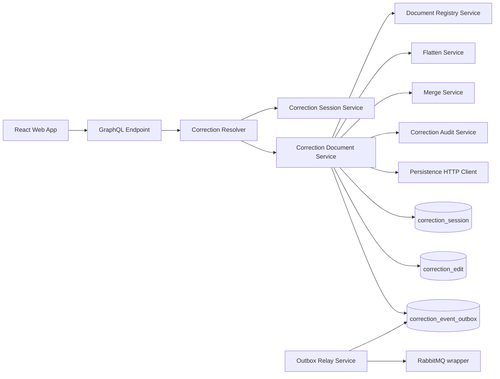
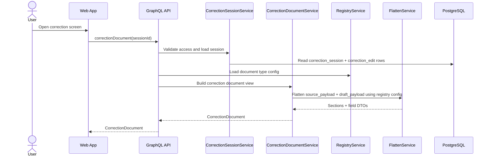
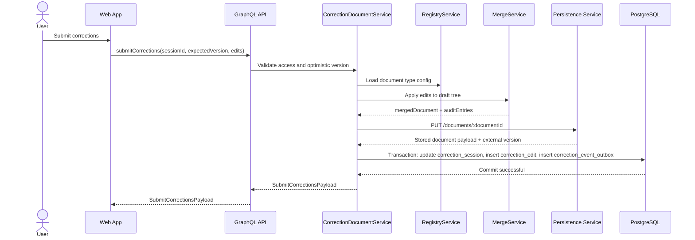
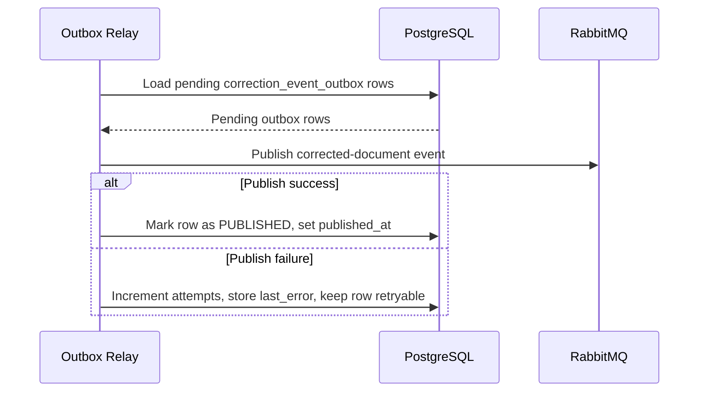
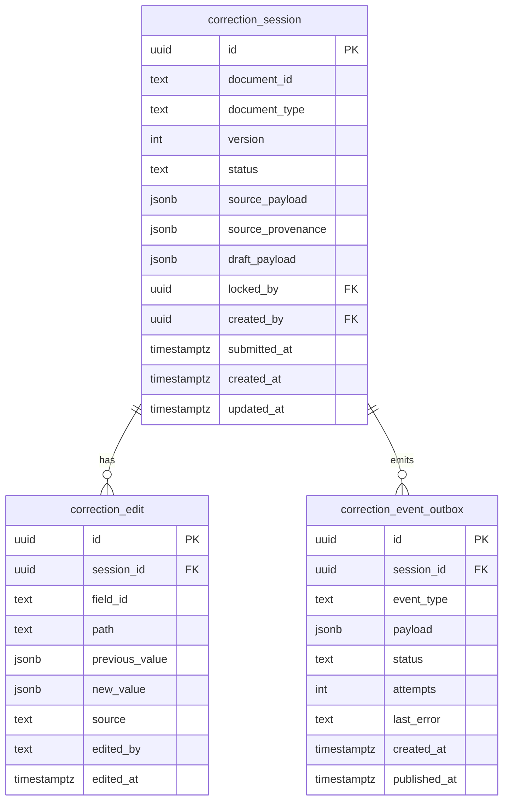

# Phase 2 Backend Correction Flow Implementation Plan

> Reference repo: `/Users/ichernob/Desktop/learn/r_d/rd_shop` (skip `.temp` and `demo`).

## Goal

Turn the completed Phase 1 session and draft foundation into the first end-to-end correction workflow.

Phase 2 should establish the backend building blocks that let the frontend render a real correction screen and submit corrected documents reliably:

- `correctionDocument` query backed by registry metadata and session snapshots.
- Flattening of the hierarchical document tree into stable editable field DTOs.
- Merge of submitted edits back into the document tree.
- Audit persistence through `correction_edit` rows.
- First reliable publish flow through `correction_event_outbox` and RabbitMQ.
- Explicit provenance storage decision for field-level source metadata.
- Explicit deferral of `processed_message` until a real consumer phase exists.

Phase 2 should stop at the first reliable submit-and-publish path. It should not yet include replay/reprocess orchestration, WebSockets, Redis, or external provider auth. Google sign-in planning moves to a later dedicated phase after the full BE-FE critical flow is stable.

## Docs Analysis Findings

Reviewing the current docs uncovered four Phase 2 constraints that should be made explicit before implementation starts:

1. The current Phase 1 session model stores only `draft_payload`.
   - That is not enough for Phase 2 because `CorrectionField` needs both `value` and `originalValue`.
   - Phase 2 should add an immutable source snapshot, preferably `source_payload`, to `correction_session`.
2. Provenance storage should be decided locally instead of being left ambiguous.

- The flatten service needs a stable way to read per-field provenance.
- Phase 2 should prefer a separate session-owned provenance JSONB field over changing the persistence document contract.

3. `processed_message` does not belong to the initial publisher-only flow.
   - In `rd_shop`, `ProcessedMessage` is used inside the worker-side transactional consumer path, not in the publisher itself.
   - For Elemika, `processed_message` should be introduced with the first RabbitMQ consumer or replay worker, not with the initial outbox publish flow.
4. External provider auth should not expand Phase 2 scope.

- The correction flow can be completed on top of the existing local JWT boundary.
- Google-only auth planning is moved to a dedicated post-critical-flow phase.

## Current Baseline Already Done

Phase 1 is now effectively complete and provides the following baseline for Phase 2:

- Schema-first GraphQL wired into NestJS.
- Local JWT signup/signin plus `me` and `signOut`.
- `User` and `correction_session` persistence.
- Registry-driven document metadata loaded from config.
- File-backed persistence mock with durable per-document storage.
- Correction-session open/load/save-draft foundation.
- RabbitMQ connection wrapper with lifecycle management.

Phase 2 should build on this baseline, not replace it.

## Scope

Phase 2 must deliver:

- `correctionDocument(sessionId)` query returning schema, fields, original values, current values, and audit history.
- `submitCorrections` mutation backed by optimistic locking on `correction_session.version`.
- `signUp` returning a success payload without `accessToken`.
- `signOut` mutation for the frontend contract boundary.
- `correctionSessions` inbox query for the current corrector.
- `source_payload` support so the immutable original document state survives later edits.
- Separate provenance JSONB storage for field-level source metadata when provenance is not embedded in the payload tree.
- Flatten service that maps registry sections and source/draft payloads to stable field DTOs.
- Merge service that applies field edits back into the draft tree.
- `correction_edit` persistence for audit history.
- `correction_event_outbox` persistence plus a relay that publishes corrected-document events to RabbitMQ.
- First corrected-document event contract.
- Clear retry/error handling for failed outbox publishing.

Phase 2 must not deliver:

- Replay/reprocess worker.
- RabbitMQ consumer-side idempotency runtime.
- `processed_message` table, migration, or runtime integration.
- Socket.IO or Redis.
- Full frontend correction UX implementation.
- External provider auth rollout.

## Exit Criteria

Phase 2 is complete when all of the following are true:

- `correctionDocument(sessionId)` returns a field-oriented document view suitable for the frontend.
- Each field includes both current draft value and original source value.
- `signUp` no longer auto-authenticates the user.
- `signOut` exists as an explicit backend contract for frontend logout.
- `correctionSessions` returns the current user's inbox list.
- `submitCorrections` enforces optimistic locking using `expectedVersion`.
- Submitted edits are merged into the hierarchical document tree deterministically.
- `correction_edit` rows are persisted for each submitted edit.
- The merged document is saved to the persistence service.
- A `correction_event_outbox` row is created transactionally with the local DB state.
- The outbox relay can publish the corrected-document event and mark the row as published.
- Failures to publish do not lose the event; retries remain possible from DB state.
- Provenance is sourced from a deliberate local model, not from ad hoc flatten-service fallbacks.
- The docs clearly state that `processed_message` is deferred until the first consumer flow.

## Core Design Decisions

### 1. Keep correction state session-based

Phase 1 already introduced `correction_session` as the durable backend boundary. Phase 2 should keep building on that instead of switching back to document-id-only orchestration.

Recommended contract direction:

- `openCorrectionSession` remains the entrypoint.
- `correctionDocument` should take `sessionId`, not raw `documentId`.
- `submitCorrections` should also take `sessionId` plus `expectedVersion`.

This avoids mixing the external document identity with the internal optimistic-lock boundary.

### 2. Add immutable source state to `correction_session`

Phase 2 needs `originalValue` for each field even after multiple draft saves and submissions.

Recommended schema adjustment:

- Add `source_payload jsonb` to `correction_session`.
- Keep `draft_payload jsonb` as the mutable working copy.
- At session creation time, initialize both from the persistence document payload.
- Draft saves update only `draft_payload`.

If provenance is not embedded inside the payload tree, add one more provenance-focused JSONB field on `correction_session` rather than trying to reconstruct provenance from audit rows later.

Concrete schema recommendation:

- Add `correction_session.source_payload jsonb` as the immutable source snapshot column.
- Add `correction_session.source_provenance jsonb null` as a path-keyed provenance map.
- Key the provenance map by the exact flattened field path used by the correction contract.
- Keep provenance separate from `draft_payload` so user edits never need to preserve extraction metadata inside the mutable document payload.

Recommended provenance shape:

```json
{
  "header.invoiceNumber": {
    "source": "OCR",
    "confidence": 0.98,
    "page": 1,
    "boundingBox": {
      "left": 0.12,
      "top": 0.08,
      "width": 0.21,
      "height": 0.03
    },
    "extractionModel": "invoice-ocr-v1"
  }
}
```

Practical migration note:

- The current runtime reads `source_payload` and `source_provenance` directly, but it also normalizes legacy flat session payloads on load and save so older sessions remain readable.
- Apply migrations `1778690276525-AddCorrectionEditAndCorrectionEventOutbox.ts` and `1778694129280-FixCorrectionEventOutboxIdDefault.ts` before exercising the Phase 2 correction query or submit flow on an existing database.
- The Phase 2 migration backfills `source_payload` from the existing draft snapshot and creates the audit/outbox tables used by the correction flow.

### 3. Prefer a separate provenance JSONB field over changing the persistence payload

Two viable approaches exist if the persistence payload does not already carry field-level provenance.

#### Option A: add a separate provenance JSONB field on `correction_session`

Pros:

- Keeps the persistence-service document contract stable.
- Limits Phase 2 changes to local DB, session initialization, and flatten logic.
- Lets Elemika model provenance specifically for correction rendering without polluting the document payload shape.
- Avoids mock-only coupling that would likely be reworked once the real persistence service is integrated.

Cons:

- The flatten service must read payload values and provenance from two session snapshots instead of one.
- Provenance data is duplicated per session rather than being stored once in the external document source.

Complexity:

- Medium-low.
- Requires one more JSONB column plus session initialization and lookup logic.

#### Option B: enrich the persistence mock document format

Pros:

- Puts values and provenance in one payload structure.
- Can make the flatten path conceptually simpler during local mock-only development.

Cons:

- Changes the persistence boundary even though the real persistence service is still treated as an external black box.
- Couples Phase 2 logic to a mock-specific document shape that may not survive real integration.
- Makes save flows responsible for preserving provider metadata inside the same document structure the user edits.
- Increases the risk of later migration churn when the real persistence payload format diverges from the mock.

Complexity:

- Medium for the mock alone, but high rework risk at the system boundary.

Recommendation:

- Choose Option A for Phase 2.
- Keep `source_payload` focused on immutable document values.
- Store provenance in a separate session-owned JSONB field and let the flatten service join the two by stable field path.

### 4. Build `correctionDocument` from session state, not live persistence fetches

For Phase 2, the `correctionDocument` query should use:

- `source_payload` for original values.
- `draft_payload` for current values.
- The session-owned provenance JSONB field for `FieldProvenance`.
- Registry config for layout, labels, validation, and repeatable-section semantics.
- `correction_edit` for audit history.

It should not fetch the document again from the persistence service during normal query execution. That would weaken optimistic version semantics and can reintroduce external drift into an already-open session.

### 5. Keep submit ordering consistent with Phase 1

The Phase 1 draft-save flow already chose persistence-first and DB-second ordering to avoid advancing local version state when the external persistence write fails.

Recommended Phase 2 submit flow:

1. Load session and validate access/version.
2. Build merged document and audit entries in memory.
3. Save merged document to the persistence service.
4. In a DB transaction:
   - update `correction_session`
   - insert `correction_edit` rows
   - insert `correction_event_outbox` row
5. After commit, trigger a best-effort outbox flush.

Tradeoff:

- There is still no distributed transaction across the persistence service and Postgres.
- That is acceptable for Phase 2 because the outbox protects RabbitMQ reliability, and the persistence-first ordering matches the already-delivered Phase 1 behavior.
- If reconciliation becomes necessary later, add an explicit repair job rather than pretending this flow is atomic today.

### 6. Keep the outbox relay inside the monolith for Phase 2

For Phase 2, a separate worker app is unnecessary. The relay can run inside `apps/api` and periodically scan pending outbox rows.

That keeps the deployment and local stack small while still giving a correct transactional outbox boundary.

## Human-Readable Backend Flow

### Runtime overview



### Phase 2 request flow

The Phase 2 backend should work like this:

1. The frontend opens or reuses a correction session through the existing Phase 1 flow.
2. The frontend requests `correctionDocument(sessionId)`.
3. The backend loads the session snapshots and registry metadata.
4. The flatten service returns UI-ready fields with current values, original values, validation metadata, and repeatable section paths.
5. The frontend submits a list of field edits with `expectedVersion`.
6. The backend validates optimistic version, merges the edits into the document tree, and persists audit rows.
7. The backend writes the merged document to the persistence service.
8. The backend stores an outbox row transactionally with the new local state.
9. The outbox relay publishes the corrected-document event to RabbitMQ and marks the row as published.

### Sequence 1: load correction document



### Sequence 2: submit corrections



### Sequence 3: publish outbox event



## Human-Readable GraphQL Schema for Phase 2

Phase 2 should expose a correction-focused contract built on top of the existing Phase 1 session flow.

It now also owns the backend contract alignment needed for the first Phase 3 frontend foundation:

- sign-up success without auto-login
- sign-out mutation
- corrections inbox query

```graphql
type Query {
  correctionDocument(sessionId: ID!): CorrectionDocument!
}

type Mutation {
  submitCorrections(input: SubmitCorrectionsInput!): SubmitCorrectionsPayload!
}

type CorrectionDocument {
  sessionId: ID!
  documentId: ID!
  documentType: String!
  version: Int!
  status: CorrectionStatus!
  publishStatus: CorrectionPublishStatus!
  schema: CorrectionSchema!
  fields: [CorrectionField!]!
  audit: [CorrectionAuditEntry!]!
  updatedAt: DateTime!
}

type CorrectionSchema {
  documentType: String!
  version: Int!
  sections: [CorrectionSection!]!
}

type CorrectionSection {
  id: String!
  label: String!
  path: String!
  repeatable: Boolean!
  fields: [CorrectionFieldMetadata!]!
}

type CorrectionFieldMetadata {
  id: String!
  path: String!
  label: String!
  inputType: FieldInputType!
  required: Boolean!
  codeListKey: String
  validation: FieldValidation
}

type CorrectionField {
  id: ID!
  path: String!
  sectionId: String!
  rowPath: String
  label: String!
  value: JSON
  originalValue: JSON
  inputType: FieldInputType!
  required: Boolean!
  codeList: [CodeListOption!]
  validation: FieldValidation
  provenance: FieldProvenance
}

type FieldValidation {
  min: Float
  max: Float
  minLength: Int
  maxLength: Int
  pattern: String
  scale: Int
}

type FieldProvenance {
  source: ProvenanceSource!
  confidence: Float
  page: Int
  boundingBox: BoundingBox
  extractionModel: String
}

type BoundingBox {
  left: Float!
  top: Float!
  width: Float!
  height: Float!
}

type CodeListOption {
  value: String!
  label: String!
}

type CorrectionAuditEntry {
  id: ID!
  fieldId: String!
  path: String!
  previousValue: JSON
  newValue: JSON
  editedBy: String!
  editedAt: DateTime!
  source: CorrectionSource!
}

input SubmitCorrectionsInput {
  sessionId: ID!
  expectedVersion: Int!
  edits: [CorrectionEditInput!]!
}

input CorrectionEditInput {
  fieldId: String!
  path: String!
  value: JSON
}

type SubmitCorrectionsPayload {
  sessionId: ID!
  documentId: ID!
  version: Int!
  status: CorrectionStatus!
  publishStatus: CorrectionPublishStatus!
  conflicts: [VersionConflict!]!
}

type VersionConflict {
  path: String!
  currentValue: JSON
  submittedValue: JSON
  reason: String!
}

enum CorrectionStatus {
  DRAFT
  SUBMITTED
  CONFLICTED
}

enum CorrectionPublishStatus {
  NOT_QUEUED
  PENDING
  PUBLISHED
  FAILED
}

enum FieldInputType {
  TEXT
  DATE
  NUMBER
  CODE_LIST
}

enum ProvenanceSource {
  OCR
  EXTRACTION
  ENRICHMENT
  USER
}

enum CorrectionSource {
  USER_EDIT
  SYSTEM_MERGE
  REPROCESS
}
```

Recommended API stance for conflicts:

- On the first implementation pass, version mismatches can still raise a GraphQL conflict exception.
- Keep `VersionConflict` in the contract design so the API can evolve into richer conflict payloads without a schema rewrite.

## Human-Readable Data Schema for Phase 2

Phase 2 should persist the smallest schema that supports deterministic flattening, merge/audit history, and reliable event publishing.



Recommended table meaning:

- `correction_session`: one working correction stream per external document.
- `source_payload`: immutable source snapshot used for `originalValue`.
- `source_provenance`: path-keyed provenance metadata used for `FieldProvenance`.
- `draft_payload`: mutable working document used for current field values and submission.
- `correction_edit`: append-only edit history generated on `submitCorrections`.
- `correction_event_outbox`: transactional buffer for corrected-document events awaiting RabbitMQ publication.

Recommended indexes:

- `correction_session(document_id)` unique.
- `correction_session(document_type, status)`.
- `correction_edit(session_id, edited_at)`.
- `correction_event_outbox(status, created_at)`.

## Task 0: Session Snapshot Refinement

**Goal:** make the Phase 1 session model sufficient for Phase 2 field rendering.

**Suggested files:**

- `apps/api/src/correction-sessions/correction-session.entity.ts`
- `apps/api/src/db/migrations/*`
- `apps/api/src/correction-sessions/correction-sessions.service.ts`

**Implementation notes:**

- Add `sourcePayload` to `CorrectionSession`.
- Add a separate provenance JSONB field on `CorrectionSession` if provenance is not already embedded in the source payload.
- Initialize `sourcePayload` and `draftPayload` together when opening a new session.
- Keep later draft saves scoped to `draftPayload` only.
- Do not enrich the persistence mock document format in Phase 2 just to carry provenance.
- Apply the Phase 2 migration before using the new correction runtime; the code now expects the source snapshot columns to exist.

## Task 1: GraphQL Contract and Resolver Boundary

**Goal:** introduce the Phase 2 correction document and submit boundaries.

**Suggested files:**

- `apps/api/src/graphql/schema/correction-document.graphql`
- `apps/api/src/corrections/corrections.resolver.ts`
- `apps/api/src/graphql/graphql.types.ts` (generated)
- `apps/api/src/corrections/corrections.module.ts`
- `apps/api/src/corrections/corrections.service.ts`

**Implementation notes:**

- Keep the new resolver thin.
- Reuse the existing auth/session access guardrails from Phase 1.
- Prefer `sessionId`-based correction queries and mutations.
- Keep `publishStatus` derivable from the latest outbox state rather than inventing another session-owned state machine too early.

## Task 2: Flatten Service

**Goal:** transform `source_payload` and `draft_payload` into a UI-ready field model.

**Suggested files:**

- `apps/api/src/corrections/services/flatten.service.ts`
- `apps/api/src/corrections/correction-flow.types.ts`
- `apps/api/src/corrections/utils/*`

**Implementation notes:**

- Registry config should define layout and field semantics.
- `source_payload` supplies `originalValue`.
- `draft_payload` supplies the mutable `value`.
- The separate session provenance field supplies `FieldProvenance`.
- Repeatable sections should emit stable `rowPath` values.
- Field ids should be deterministic and registry-driven, not generated ad hoc from array order alone.
- Do not hard-code fake provenance deep in the flatten service.

## Task 3: Merge Service and Audit Modeling

**Goal:** apply field edits back onto the hierarchical tree and generate audit rows.

**Suggested files:**

- `apps/api/src/corrections/services/merge.service.ts`
- `apps/api/src/corrections/correction-edit.entity.ts`
- `apps/api/src/corrections/correction-flow.types.ts`

**Implementation notes:**

- The merge service should work from the current `draft_payload`, not from `source_payload`.
- Use registry metadata to validate that each edit path is legal for the document type.
- Generate one `correction_edit` row per submitted field change.
- Store both `previous_value` and `new_value` so later conflict/replay analysis does not require payload diffs.
- Keep source values immutable; never rewrite `source_payload` during submit.
- Keep audit-row assembly inside the merge-plus-submit flow for now; a separate audit service is unnecessary at the current scope.

## Validation Checklist For Steps 1-4

These checks cover the work delivered so far for the first four items in the suggested execution order.

- `CorrectionSession` now persists `sourcePayload` and `sourceProvenance` as first-class fields; legacy flat sessions are normalized into the current nested registry shape on load and save.
- Migration `1778690276525-AddCorrectionEditAndCorrectionEventOutbox.ts` adds the source snapshot columns, backfills `source_payload`, and creates the Phase 2 audit/outbox tables.
- Migration `1778694129280-FixCorrectionEventOutboxIdDefault.ts` aligns the outbox id default for existing databases.
- The GraphQL schema includes live `correctionDocument(sessionId)` and `submitCorrections(input)` boundaries.
- The correction resolver now lives inside `apps/api/src/corrections`, matching the feature-slice structure used elsewhere in the backend.
- `graphql.types.ts` is updated consistently with the new Phase 2 SDL without requiring a local codegen run.
- Auth SDL now separates `signUp` success from `signIn` token issuance.
- `signOut` exists as a protected backend mutation.
- `correctionSessions` exists as a protected inbox query for the current user.
- Document-registry validation supports optional `codeListKey` and field-level `validation` metadata needed by the Phase 2 contract.
- The flatten service builds section metadata and field DTOs from registry config plus session snapshots.
- Repeatable sections produce deterministic `rowPath` and field ids, using row object identifiers when available and array index fallback otherwise.
- Provenance lookup is path-based, implemented through feature-local helpers in `apps/api/src/corrections/utils`, and stays outside the mutable document payload.
- `normalizeCorrectionStatus`, `getSourceProvenance`, and `isCorrectionFieldProvenance` are extracted into `apps/api/src/corrections/utils` and re-exported from `utils/index.ts`.
- The merge service validates edit targets against registry-derived field paths, returns a cloned merged payload, and produces audit drafts with `previousValue` and `newValue`.
- `correction_edit` and `correction_event_outbox` are both wired into the Phase 2 runtime shape.
- Editor diagnostics are clean for the touched session, GraphQL, registry, and corrections module files.

## Task 4: `correctionDocument` Query Implementation

**Goal:** return a complete correction document view for the frontend.

**Suggested files:**

- `apps/api/src/corrections/corrections.service.ts`
- `apps/api/src/corrections/services/flatten.service.ts`

**Implementation notes:**

- Load `CorrectionSession` plus related users and edits.
- Resolve registry config from `documentType`.
- Build `schema`, `fields`, `audit`, and derived `publishStatus`.
- Do not make live persistence GET requests in the steady-state query path.

## Task 5: `submitCorrections` Command Flow

**Goal:** implement the first real correction submit path.

**Suggested files:**

- `apps/api/src/corrections/corrections.service.ts`
- `apps/api/src/persistence/persistence.client.ts`
- `apps/api/src/corrections/services/merge.service.ts`
- `apps/api/src/corrections/correction-edit.entity.ts`
- `apps/api/src/corrections/correction-flow.types.ts`

**Implementation notes:**

- Validate session ownership and `expectedVersion` first.
- Merge edits in memory before any side effects.
- Save the merged payload to the persistence service.
- Wrap the local DB mutation in one transaction.
- Inside that transaction:
  - update `correction_session.draft_payload`
  - update `version`, `status`, `submitted_at`, `locked_by`
  - insert `correction_edit` rows
  - insert a `correction_event_outbox` row
- After commit, trigger a best-effort outbox flush.

## Task 6: Outbox and First Publish Flow

**Goal:** make corrected-document publishing reliable without introducing a second service.

**Suggested files:**

- `apps/api/src/corrections/corrections.service.ts`
- `apps/api/src/corrections/correction-edit.entity.ts`
- `apps/api/src/rabbitmq/rabbitmq.service.ts`
- `apps/api/src/rabbitmq/rabbitmq.types.ts`
- `apps/api/src/config/env.schema.ts`
- `apps/api/.env.example`

**Implementation notes:**

- The outbox row should be created in the same DB transaction as the session and audit updates.
- The relay can run on an interval inside the API monolith in Phase 2.
- The publisher and relay currently live inside `corrections.service.ts` to keep the active runtime in one feature-local file.
- The outbox entity currently lives alongside `CorrectionEdit` in `correction-edit.entity.ts`.
- Publishing should set RabbitMQ `messageId` explicitly.
- On success, mark the row as `PUBLISHED` and set `published_at`.
- On failure, increment `attempts`, store `last_error`, and keep the row retryable.
- A best-effort immediate flush after commit is useful, but reliability must not depend on that immediate attempt succeeding.

## Task 7: Postpone `processed_message`

Phase 2 should not add `processed_message` at all.

Reasoning:

- The Phase 2 runtime has a publisher and outbox relay, but no correction consumer yet.
- `processed_message` only becomes useful when a consumer transaction needs to deduplicate delivery.
- Adding the table early would create migration and schema surface with no active behavior attached to it.
- `rd_shop` uses `ProcessedMessage` in the worker-side path, which is the same boundary Elemika should follow later.

Decision:

- No `processed_message` entity in Phase 2.
- No `processed_message` migration in Phase 2.
- No publisher code should depend on future consumer-idempotency tables.

Future trigger:

- Revisit `processed_message` only when a correction worker, replay worker, or another real RabbitMQ consumer is introduced.

## Task 8: Validation Checklist

Phase 2 validation should include all of the following:

- `correctionDocument(sessionId)` returns schema, fields, current values, original values, and audit history.
- Repeated query calls do not hit the persistence service for session-state reconstruction.
- `submitCorrections` rejects stale `expectedVersion` values.
- `submitCorrections` persists the merged document to the persistence service.
- `submitCorrections` writes `correction_edit` rows.
- `submitCorrections` creates a `correction_event_outbox` row in the same DB transaction as the session update.
- The outbox relay publishes to RabbitMQ and marks the row as published.
- Publish failures leave retryable rows in DB with incremented attempt metadata.
- If `processed_message` is still deferred, no unused runtime path depends on it.

## Manual E2E Verification Runbook

This runbook is written for manual execution. None of the commands below were run as part of this implementation pass.

### 1. Reset or reuse the local stack

Use a clean reset if you want the seeded document and database state back at their defaults.

```bash
cd apps/api
cp .env.example .env.local
npm run docker:down:local
npm run docker:start:local
npm run docker:migrate:local
```

If you want to preserve existing local data, skip `docker:down:local` and keep the existing `.env.local`.

### 2. Confirm the API and persistence mock are reachable

```bash
curl -s http://localhost:8080/health
curl -s http://localhost:8090/health
```

Expected results:

- API returns `{ "service": "api", "status": "ok" }`.
- Persistence mock returns `{ "service": "persistence-mock", "status": "ok" }`.

### 3. Use the seeded persistence document

The persistence mock seeds one document automatically:

- `documentId`: `demo-invoice-001`
- `documentType`: `supplier_invoice`

You can inspect it directly:

```bash
curl -s http://localhost:8090/demo-invoice-001
```

Expected payload highlights:

- `header.invoiceNumber = "INV-2026-001"`
- `header.invoiceDate = "2026-05-01"`
- `header.supplierName = "Acme Supplies"`

### 4. Sign up a corrector user

```bash
curl -s http://localhost:8080/graphql \
  -H 'content-type: application/json' \
  --data '{
    "query": "mutation SignUp($input: SignUpInput!) { signUp(input: $input) { success user { id email displayName roles scopes } } }",
    "variables": {
      "input": {
        "email": "corrector@example.com",
        "password": "Passw0rd!",
        "displayName": "Correction Tester"
      }
    }
  }'
```

Expected result:

- `success = true`.
- `roles` contains `CORRECTOR`.
- `scopes` contains `corrections:write`.

### 5. Sign in to establish the authenticated session

```bash
curl -s http://localhost:8080/graphql \
  -H 'content-type: application/json' \
  --data '{
    "query": "mutation SignIn($input: SignInInput!) { signIn(input: $input) { accessToken user { id email roles scopes } } }",
    "variables": {
      "input": {
        "email": "corrector@example.com",
        "password": "Passw0rd!"
      }
    }
  }'
```

Save the access token for the next steps:

```bash
export TOKEN='<paste accessToken here>'
```

### 6. Verify the authenticated identity

```bash
curl -s http://localhost:8080/graphql \
  -H 'content-type: application/json' \
  -H "authorization: Bearer $TOKEN" \
  --data '{"query":"query Me { me { id email displayName roles scopes } }"}'
```

Expected result:

- The same user is returned.
- Roles and scopes still include correction access.

### 7. Verify the corrections inbox query

```bash
curl -s http://localhost:8080/graphql \
  -H 'content-type: application/json' \
  -H "authorization: Bearer $TOKEN" \
  --data '{"query":"query CorrectionSessions { correctionSessions { id documentId documentType status version updatedAt } }"}'
```

Expected result:

- The query succeeds for the authenticated corrector.
- Before opening a session, the list may be empty.

### 7a. Optional: verify the sign-out contract boundary

```bash
curl -s http://localhost:8080/graphql \
  -H 'content-type: application/json' \
  -H "authorization: Bearer $TOKEN" \
  --data '{"query":"mutation SignOut { signOut { success } }"}'
```

Expected result:

- `success = true`.
- Treat this as a frontend contract and audit boundary, not as JWT revocation.

If you run this step and want a fresh token for the remaining checks, repeat Step 5.

### 8. Discover the available document types

```bash
curl -s http://localhost:8080/graphql \
  -H 'content-type: application/json' \
  -H "authorization: Bearer $TOKEN" \
  --data '{"query":"query DocumentTypes { correctionDocumentTypes { type version label } }"}'
```

Expected result:

- `supplier_invoice` is present.

### 9. Open a correction session for the seeded document

```bash
curl -s http://localhost:8080/graphql \
  -H 'content-type: application/json' \
  -H "authorization: Bearer $TOKEN" \
  --data '{
    "query": "mutation OpenSession($input: OpenCorrectionSessionInput!) { openCorrectionSession(input: $input) { id documentId documentType status version draftPayload createdAt updatedAt } }",
    "variables": {
      "input": {
        "documentId": "demo-invoice-001",
        "documentType": "supplier_invoice"
      }
    }
  }'
```

Expected result:

- A session is created or reused.
- `status` is `draft`.
- `version` is `1` on a fresh reset.

Save the session id:

```bash
export SESSION_ID='<paste session id here>'
```

In the next GraphQL examples, replace `<SESSION_ID>` with the value you exported.

### 10. Load the correction document view

```bash
curl -s http://localhost:8080/graphql \
  -H 'content-type: application/json' \
  -H "authorization: Bearer $TOKEN" \
  --data '{
    "query": "query CorrectionDocument($sessionId: ID!) { correctionDocument(sessionId: $sessionId) { sessionId documentId documentType version status publishStatus schema { documentType version sections { id label path repeatable fields { id label path inputType required } } } fields { id path sectionId rowPath label value originalValue inputType required provenance { source confidence page extractionModel } } audit { id fieldId path previousValue newValue editedBy editedAt source } updatedAt } }",
    "variables": {
      "sessionId": "<SESSION_ID>"
    }
  }'
```

Expected result on a fresh reset:

- `status` is `DRAFT`.
- `publishStatus` is `NOT_QUEUED`.
- `audit` is empty.
- The `invoice_number` field exists with path `header.invoiceNumber`.
- That field has both `value` and `originalValue` equal to `INV-2026-001`.

### 11. Optional: exercise the Phase 1 draft-only mutation

Skip this step if you want the shortest Phase 2 verification path.

```bash
curl -s http://localhost:8080/graphql \
  -H 'content-type: application/json' \
  -H "authorization: Bearer $TOKEN" \
  --data '{
    "query": "mutation SaveDraft($input: SaveCorrectionSessionDraftInput!) { saveCorrectionSessionDraft(input: $input) { id version status draftPayload updatedAt } }",
    "variables": {
      "input": {
        "sessionId": "<SESSION_ID>",
        "expectedVersion": 1,
        "draftPayload": {
          "header": {
            "invoiceDate": "2026-05-01",
            "invoiceNumber": "INV-2026-001-DRAFT",
            "supplierName": "Acme Supplies"
          },
          "totals": {
            "grossAmount": 1250.42,
            "netAmount": 1000.34,
            "taxAmount": 250.08
          }
        }
      }
    }
  }'
```

If you run this step:

- `version` increments before the Phase 2 submit step.
- The persistence mock document version also increments.
- Use the new session version as `expectedVersion` in the next step.

### 12. Submit a correction through the Phase 2 flow

Use `expectedVersion = 1` if you skipped the draft-save step above. If you ran it, use the returned version instead.

```bash
curl -s http://localhost:8080/graphql \
  -H 'content-type: application/json' \
  -H "authorization: Bearer $TOKEN" \
  --data '{
    "query": "mutation SubmitCorrections($input: SubmitCorrectionsInput!) { submitCorrections(input: $input) { sessionId documentId version status publishStatus conflicts { path currentValue submittedValue reason } } }",
    "variables": {
      "input": {
        "sessionId": "<SESSION_ID>",
        "expectedVersion": 1,
        "edits": [
          {
            "fieldId": "invoice_number",
            "path": "header.invoiceNumber",
            "value": "INV-2026-001-CORRECTED"
          }
        ]
      }
    }
  }'
```

Expected result on the happy path:

- `status` is `SUBMITTED`.
- `conflicts` is empty.
- `version` increments by one.
- `publishStatus` is usually `PUBLISHED` when RabbitMQ is healthy. It may briefly be `PENDING` during relay timing.

### 13. Reload the correction document after submit

Run the same `correctionDocument(sessionId)` query again.

Expected result after submit:

- `fields[].value` for `header.invoiceNumber` is `INV-2026-001-CORRECTED`.
- `fields[].originalValue` for `header.invoiceNumber` is still `INV-2026-001`.
- `audit` contains one `USER_EDIT` entry.
- `publishStatus` matches the outbox state.

### 14. Verify the persistence mock state directly

```bash
curl -s http://localhost:8090/demo-invoice-001
```

Expected result:

- `payload.header.invoiceNumber` is `INV-2026-001-CORRECTED`.
- `version` increased compared with the initial seed state.

### 15. Verify the Postgres rows

```bash
docker exec -it elemika_api_local-postgres psql -U elemika -d elemika -c "select id, document_id, status, version, source_payload->'header'->>'invoiceNumber' as source_invoice_number, draft_payload->'header'->>'invoiceNumber' as draft_invoice_number from correction_session order by created_at desc;"

docker exec -it elemika_api_local-postgres psql -U elemika -d elemika -c "select session_id, field_id, path, previous_value, new_value, source, edited_at from correction_edit order by edited_at desc;"

docker exec -it elemika_api_local-postgres psql -U elemika -d elemika -c "select session_id, event_type, status, attempts, published_at, last_error from correction_event_outbox order by created_at desc;"
```

Expected result:

- `correction_session.source_payload` still shows the original invoice number.
- `correction_session.draft_payload` shows the corrected invoice number.
- `correction_edit` contains one row for `invoice_number` / `header.invoiceNumber`.
- `correction_event_outbox` contains one row with `status = PUBLISHED` on the happy path.

### 16. Verify the RabbitMQ queue

Open RabbitMQ management UI:

- URL: `http://localhost:15672`
- Username: `elemika`
- Password: `elemika`

Then inspect queue `correction.completed`.

Expected result:

- The queue exists.
- A submitted correction produces a `document.corrected` message.
- If no consumer is attached, the message remains visible as ready in the queue.

### 17. Verify the optimistic-lock failure path

Resubmit the same mutation from step 11 with the old `expectedVersion`.

Expected result:

- The API returns a version-mismatch error.
- No new `correction_edit` row is written for the rejected request.

### 18. Shut the stack down when finished

```bash
cd apps/api
npm run docker:down:local
```

## Suggested Execution Order

1. Add the immutable source snapshot (`source_payload`) to `correction_session`.
2. Finalize the Phase 2 GraphQL contract.
3. Implement the flatten service against session snapshots and registry config.
4. Implement the merge service and `correction_edit` entity.
5. Implement `correctionDocument(sessionId)`.
6. Implement `submitCorrections` with persistence-first plus transactional local writes.
7. Add `correction_event_outbox` and the in-process outbox relay.
8. Validate the correction load/submit/publish flow locally.
9. Keep external auth and consumer idempotency in later dedicated phases.

## External Auth Is Deferred To A Later Phase

Google external auth planning now lives in `docs/phase-6-google-oidc-auth-plan.md`.

Phase 2, Phase 3, Phase 4, and Phase 5 should continue assuming the existing local JWT flow so the correction contract and end-to-end submission path can stabilize first.

## Handoff to Phase 3

The current backend implementation satisfies the Phase 2 exit criteria, so frontend work can proceed against a stable correction contract on:

- Apollo-backed `correctionDocument` query hooks.
- Metadata-driven field rendering.
- Submit flow wired to `submitCorrections`.
- Conflict handling UX.
- Publish-status feedback without requiring WebSockets yet.
- Local JWT auth remains sufficient until the later Google auth phase starts.
