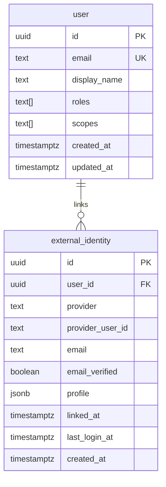
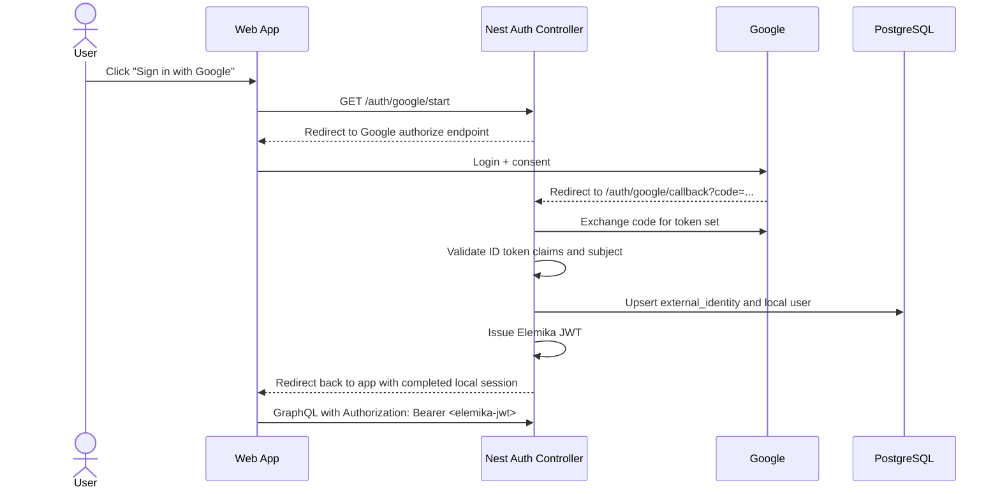

# Phase 6 Google OIDC Auth Plan

## Goal

Add external sign-in only after the full BE-FE correction flow is already stable.

For Elemika, that means this phase starts only after the backend correction flow, frontend correction UX, and integration hardening are complete enough that auth no longer blocks the core document-correction feedback loop.

This phase is intentionally Google-only.

GitHub, multi-provider account linking, and dedicated identity-broker adoption stay out of scope until the Google path proves stable and worth extending.

## Why This Is A Separate Phase

The correction workflow is the product-critical path.

If external auth is introduced too early, it expands risk across:

- frontend routing and session bootstrap
- backend guard behavior
- local user lifecycle and role assignment
- callback handling and environment setup

That is avoidable churn while the correction contract is still moving.

The better sequencing is:

1. finish the correction load/edit/submit/publish path
2. harden FE-BE integration on local JWT
3. add Google sign-in as a later auth phase

## Scope

Phase 6 should deliver:

- Google-only sign-in.
- Local user linking between Google identity and Elemika `User`.
- Issuing the same Elemika JWT shape already used by GraphQL.
- A frontend login entrypoint and callback completion flow.
- Role/scope assignment continuing to come from Elemika, not directly from Google claims.

Phase 6 should not deliver:

- GitHub sign-in.
- Generic multi-provider auth abstraction beyond what Google needs.
- Dedicated identity broker infrastructure.
- Refresh-token-heavy offline Google API integration.
- Account linking UI.
- Replacing all existing local JWT development paths.

## Google-Only Options For Elemika

### Option A: direct frontend Google OIDC

Shape:

- The web app redirects the user to Google.
- The web app receives Google-managed auth state and tokens.
- The GraphQL API validates Google tokens directly and maps them to a local user.

Pros:

- Smallest conceptual distance to standard browser OIDC.
- Reasonable fit if the only goal is a quick Google-only prototype.
- Keeps the backend callback surface smaller than a brokered flow.

Cons:

- The backend must now support Google-token validation in addition to the existing Elemika JWT path.
- Local roles/scopes still need a user lookup or provisioning step on every authenticated request path.
- The frontend becomes responsible for Google token/session lifecycle behavior.
- The GraphQL boundary now accepts two token models instead of one.

Complexity:

- Medium.
- The code volume looks small at first, but auth behavior becomes more distributed across FE and BE.

### Option B: backend Google auth broker that issues Elemika JWTs

Shape:

- The frontend starts login against a backend REST endpoint.
- The backend redirects to Google and receives the callback.
- The backend exchanges the code, validates identity, upserts the local user/external identity mapping, and issues an Elemika JWT.
- The frontend keeps using Elemika JWTs against GraphQL.

Pros:

- Keeps the GraphQL auth boundary unchanged.
- Preserves the current Nest guard model and local roles/scopes ownership.
- Avoids dual bearer-token semantics in resolvers and guards.
- Makes a later second provider easier because the frontend still talks only to Elemika auth.
- Better fit for an application that already has local JWT auth and user records.

Cons:

- More backend code than direct browser-managed Google OIDC.
- Requires REST start/callback endpoints and redirect handling.
- The backend owns Google-specific code exchange and identity resolution.

Complexity:

- Medium.
- More explicit backend work, but lower architectural churn in the rest of the application.

## Recommendation For Elemika

Choose Option B: backend Google auth broker that issues Elemika JWTs.

Why this is the better fit:

- Elemika already has local JWT auth and GraphQL guards.
- Correction access control, roles, and scopes are application concerns, not Google concerns.
- Keeping GraphQL on one bearer-token model reduces churn across FE hooks, Apollo setup, and resolver auth.
- If GitHub is ever added later, the frontend auth shape can remain unchanged.

Direct frontend Google OIDC is viable for a throwaway prototype, but it is not the best fit for the current monolith once local users and GraphQL authorization already exist.

## Recommended Data Model

Recommended constraints:

- `external_identity(provider, provider_user_id)` unique.
- `user(email)` remains unique while email is still the local primary identity.

## Human-Readable Recommended Flow

## Suggested Execution Order

1. Add `external_identity` persistence and migration.
2. Add Google auth config validation for client id, client secret, redirect URI, and issuer/audience settings.
3. Implement `GET /auth/google/start` and `GET /auth/google/callback` controllers.
4. Exchange the authorization code and validate Google identity claims.
5. Upsert the local `User` plus `external_identity` link.
6. Issue the existing Elemika JWT format.
7. Add a frontend callback route and session bootstrap flow.
8. Keep local email/password login available until Google sign-in is stable, then decide whether both modes should remain.

## Exit Criteria

This phase is complete when all of the following are true:

- A user can sign in with Google and land back in the web app authenticated.
- GraphQL continues to receive only Elemika JWTs.
- Local user roles/scopes still govern authorization.
- Existing local JWT development flow still works unless it is intentionally retired later.
- No GitHub-specific logic is present in the runtime path.

## Future Expansion

Only after the Google-only path is stable should Elemika decide whether to:

- add GitHub through the same backend-broker pattern
- adopt a dedicated identity broker
- retire local email/password for some environments
